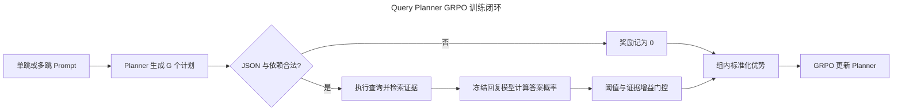

# Query Planner GRPO 算法与训练配置设计

> 本文用于训练落地和面试说明。当前内容是基于 1,000 条单跳与 4,000 条多跳 GRPO-ready 数据、`Qwen/Qwen3-4B-Instruct-2507` 和单机 4 张 A100 的首版工程方案，不代表已经跑出的实验结果。

## 🎯 方案结论

推荐从多跳 SFT 冷启动检查点出发，先做 **LoRA GRPO**，不要直接从原始 Instruct 模型开始，也不建议第一轮就进行全参数训练。

- Planner：`Qwen/Qwen3-4B-Instruct-2507`
- 初始权重：20K 单跳 SFT 后，再训练 2K 多跳 SFT 的冷启动检查点
- 每个 Prompt 的 rollout 数：`G = 8`
- 每步 Prompt 数：`64`
- 每步候选计划数：`64 × 8 = 512`
- 训练轮数：先跑 `2 epochs`，约 `158` 个 rollout 迭代
- 核心奖励：冻结回复模型对正确答案 token 的归一化概率是否超过阈值
- 推荐奖励版本：同时要求“带检索证据的答案概率”明显高于“无证据答案概率”
- 防奖励投机：单跳样本必须保持一跳，多跳样本不得超过参考跳数，重复查询直接门控为 0
- 首轮实现：自研同步 Trainer，便于把检索执行和 reward 查清楚
- 稳定后迁移：veRL 的 FSDP2 + vLLM Hybrid Engine

Qwen3-4B-Instruct-2507 是 4B 参数、仅支持 non-thinking 模式的模型，原生上下文长度远大于本项目的规划输入需要；本项目会主动把 Prompt 和输出长度收紧，以提高 rollout 吞吐并减少无效长输出。[Qwen 官方模型卡](https://huggingface.co/Qwen/Qwen3-4B-Instruct-2507)

## 🧭 端到端训练流程



图中的监督信号已经从“生成 Query 与参考 Query 的文本相似度”，转变成“这个 Query Plan 最终能否帮助回复模型更确信正确答案”。因此，模型允许生成与参考计划措辞不同但实际有效的查询。

一次训练迭代按以下顺序执行：

1. 从 GRPO 数据中采样 64 个问题，只把 `system + instruction + input` 交给 Planner。
2. 当前旧策略对每个问题采样 8 个候选 JSON 计划，共得到 512 个 rollout。
3. 校验 JSON、查询数量、依赖拓扑、占位符和答案泄漏；再按 `task_type` 检查是否过度拆分或重复查询，不合法或投机样本直接奖励为 0。
4. 按 `depends_on` 顺序执行计划，用前一跳返回结果替换下一跳占位符，并检索证据。
5. 冻结回复模型，在“原问题 + 检索证据”条件下对 Gold 答案做 teacher forcing 打分。
6. 对答案概率做固定阈值判断，得到 0/1 奖励；同一 Prompt 的 8 个候选在组内计算相对优势。
7. 重新计算当前策略和参考策略的 token log probability，执行一次 clipped GRPO 更新。
8. 将新 LoRA adapter 同步给 rollout worker，进入下一步。

GRPO 通过同一问题下的一组候选估计相对优势，不额外训练价值模型，这是它相对 PPO 更适合本项目的一点。[DeepSeekMath / GRPO 原始论文](https://arxiv.org/abs/2402.03300)

### 一条数据如何进入训练

当前 `grpo_train.jsonl` 中的一条真实数据可以简化为：

```json
{
  "instruction": "Create the minimum sufficient retrieval query plan. Use one standalone query when it is sufficient; otherwise use ordered queries with explicit dependencies. Return JSON only and do not answer the question.",
  "input": "Question:\nWhen was free education introduced to the country from which Wasana originated?",
  "output": "{\"queries\":[{\"id\":\"q1\",\"query\":\"What country did Wasana originate?\",\"depends_on\":[]},{\"id\":\"q2\",\"query\":\"when was free education introduced in {{q1.answer}}\",\"depends_on\":[\"q1\"]}]}",
  "reference_answer": "1 October 1945",
  "answer_aliases": [],
  "hop_answers": ["Sri Lanka", "1 October 1945"],
  "gold_doc_ids": ["musique_91b3e7c265eedcb6", "musique_56b9e15ec9f28ae2"],
  "hop_count": 2,
  "task_type": "multi_hop",
  "namespace": "musique_aux"
}
```

Planner 在 GRPO rollout 时只能看到 `system + instruction + input`，例如：

```text
System:
You are a retrieval query planner. Return valid JSON only. Do not answer the
user's question. Preserve named entities, dates, quantities, relationships,
and eligibility constraints.

User:
Create the minimum sufficient retrieval query plan. Use one standalone query
when it is sufficient; otherwise use ordered queries with explicit dependencies.
Return JSON only and do not answer the question.

Question:
When was free education introduced to the country from which Wasana originated?
```

模型生成 8 个不同候选计划。计划执行器先检索 Wasana 的来源国家，得到 `Sri Lanka`，再替换 `{{q1.answer}}` 执行第二跳。回复模型随后收到：

```text
System:
Answer the question using only the supplied evidence. Return only the short answer.

Question:
When was free education introduced to the country from which Wasana originated?

Evidence:
[候选计划实际检索出的文档片段]

Answer:
```

Reward worker 不让回复模型自由生成，而是在 `Answer:` 后 teacher-force `1 October 1945`，读取这些 Gold token 的 logits。`output`、`hop_answers` 和 `gold_doc_ids` 只用于离线审计、校准和评测，不能泄漏进 Planner 或回复模型的线上输入。

## 🏆 Reward 设计

### 为什么不用文本相似度

文本相似度只能判断生成计划是否“像参考答案”，但无法可靠判断它是否真的检索到有效证据。例如：

- “John Locke political beliefs basis”与参考 Query 措辞不同，但可能检索效果很好。
- 一个计划可以复制参考 Query 的大部分词，却遗漏关键实体或错误连接两跳。
- 多跳问题允许多条有效检索路径，单一参考计划并不是唯一正确答案。

因此 reward 应评价计划执行后的下游回答效果，而不是表面文本重合度。

### 正确答案 token 概率

设冻结回复模型为 $p_\phi$，Gold 答案 token 为 $a_1, \ldots, a_T$，问题为 $q$，候选计划检索出的证据为 $E$。使用 teacher forcing 计算每个正确 token 的概率，然后取几何平均：

```math
s_{\mathrm{ans}}(q,E,a) = \exp\left(\frac{1}{T}\sum_{t=1}^{T}\log p_\phi(a_t \mid q,E,a_{\lt t})\right)
```

基础二值奖励为：

```math
r_{\mathrm{abs}} = \mathbf{1}\left[s_{\mathrm{ans}} \ge \tau_{\mathrm{abs}}\right]
```

这里不能直接使用整段答案概率的连乘。连乘结果会随答案 token 数增加而快速变小，使较长答案天然更难超过阈值。几何平均把不同长度答案放到更可比的尺度上。

如果一条数据存在 `answer_aliases`，分别计算标准答案和所有别名的分数，取最大值：

```math
s_{\mathrm{alias}} = \max_{a \in \mathcal{A}} s_{\mathrm{ans}}(q,E,a)
```

### 推荐的证据增益门控

仅用绝对概率存在一个漏洞：回复模型可能依靠参数记忆直接回答，不需要 Planner 检索到正确证据。推荐同时计算无检索证据时的答案概率 $s_{\mathrm{base}}$，只有检索证据既达到绝对阈值、又带来足够增益时才给 1 分：

```math
r = \mathbf{1}\left[s_{\mathrm{with}} \ge \tau_{\mathrm{abs}}\right]
    \cdot \mathbf{1}\left[s_{\mathrm{with}} - s_{\mathrm{base}} \ge \delta\right]
```

首轮可把 `tau_abs = 0.35`、`delta = 0.05` 作为待校准起点，而不是宣称其为最终最优值。阈值应在独立校准集上固定：

1. 正样本使用 Gold 文档或高质量检索证据。
2. 负样本使用无证据、随机干扰文档和错误计划的检索结果。
3. 比较 `tau_abs ∈ {0.25, 0.35, 0.45}`，选择最能区分正负证据的阈值。
4. 同时保证初始策略的正奖励率大致处于 `20%～50%`，避免多数 rollout 全为 0 或全为 1。
5. 训练过程中固定阈值；不能随着当前 batch 临时改变，否则 reward 标尺会漂移。

### 防止强行拆分与查询堆叠

如果奖励只看最终答案概率，Planner 可能通过增加无关查询、重复召回或把单跳问题强行拆成多跳来提高偶然命中率。数据与 reward 需要共同约束这个漏洞：

- GRPO-ready 保留 1,000 条单跳样本，占 20%；其 `task_type = single_hop`、`hop_count = 1`。
- Planner Prompt 统一要求生成“最小充分计划”，不向模型直接透露 `task_type` 或参考 `hop_count`，避免把任务退化成按标签选择输出长度。
- 单跳候选只要生成超过一个 Query，即使最终答案命中，也将奖励门控为 0。
- 多跳候选允许少于或等于参考 `hop_count` 的有效替代路径，但超过参考跳数时奖励为 0，避免靠堆叠查询扩大召回面。
- 规范化后完全重复的 Query、无新增证据的冗余步骤或循环依赖直接记 0。
- DPO 同时提供单跳正确偏好，以及步骤遗漏、依赖断裂、步骤冗余、单步过宽、关系遗漏五类多跳负样本，让策略在进入 GRPO 前先学会“该拆才拆、拆则完整”。

设生成计划的查询数为 $n_{\mathrm{gen}}$，数据记录的参考跳数为 $n_{\mathrm{ref}}$，则首版跳数门控为：

```math
g_{\mathrm{hop}} = \mathbf{1}\left[n_{\mathrm{gen}} \le n_{\mathrm{ref}}\right]
```

最终奖励在答案与证据增益门控之外再乘以 $g_{\mathrm{hop}}$ 和去重门控。这里允许多跳问题用更短但确实有效的计划，避免把参考分解误当成唯一正确路径；但不允许通过增加额外步骤骗取 reward。

### 回复模型的实现口径

“生成正确答案 token 的概率”在实操中不需要真的采样一段回复，而是把 Gold 答案接在固定回答 Prompt 后面，一次前向传播读取对应位置的 logits。这种 teacher-forced scoring 更稳定、计算更便宜，也能直接得到每个 Gold token 的概率。

回复模型必须满足以下约束：

- 全程冻结、`eval` 模式、固定 chat template 和证据排列顺序。
- 评分输入中只能出现实际检索结果，不能放入参考计划、逐跳答案或 Gold 文档 ID。
- Planner 生成的 Query 若直接泄漏最终答案，整条 rollout 强制记 0。
- 第一阶段可复用冻结的 Qwen3-4B 作为回复模型，控制显存和工程复杂度。
- 后续用独立、更强的回复模型复评，检查是否只是在迎合同源模型。

### 二值奖励的稀疏性问题

若某个 Prompt 的 8 个候选奖励完全相同，组内优势全为 0，这个 Prompt 本步不能提供有效梯度。若单个候选获得 1 分的概率为 $p$，组内至少同时出现正负样本的概率为：

```math
P_{\mathrm{info}} = 1 - p^G - (1-p)^G
```

因此需要持续监控“零方差组比例”。推荐规则：

- 零方差组比例低于 30%：保持 `G = 8`。
- 连续多个窗口高于 40%：先检查阈值是否失衡，再考虑把 `G` 提高到 16。
- 正奖励率低于 10%：降低阈值、增加采样多样性或先补充冷启动训练。
- 正奖励率高于 90%：提高阈值或增强负证据，避免任务过于容易。

不建议一开始就在 0/1 奖励上叠加大量格式分、长度分和相似度分。格式合法性、答案泄漏、跳数上限更适合作为 reward gate：违规直接归零；最终优化目标仍保持端到端答案效果，解释更清晰。

## ⚙️ 公共训练超参数

### 推荐基线

| 类别 | 参数 | 推荐值 | 调整范围与说明 |
| --- | --- | ---: | --- |
| 模型 | Policy | Qwen3-4B-Instruct-2507 | 从多跳冷启动检查点加载 |
| 参数高效训练 | LoRA rank / alpha | 32 / 64 | 首轮不做全参数训练 |
| 参数高效训练 | LoRA dropout | 0.05 | 目标层为 `all-linear` |
| 精度 | dtype | BF16 | A100 原生支持 |
| 输入 | max prompt length | 768 | 超长样本可提高到 1024 |
| 输出 | max response length | 384 | JSON 计划通常远短于此值 |
| Rollout | Prompt batch | 64 | 每次更新的问题数 |
| Rollout | group size `G` | 8 | 稀疏时再尝试 16 |
| Rollout | candidates/update | 512 | `64 × 8` |
| 采样 | temperature | 0.7 | 与 Qwen 官方建议一致的起点 |
| 采样 | top-p / top-k | 0.8 / 20 | `min-p = 0` |
| 验证 | temperature / n | 0 / 1 | 贪心生成，便于横向比较 |
| 优化 | PPO/GRPO epochs | 1 | 同一批 rollout 只更新一轮 |
| 优化 | mini batch | 16 prompts / 128 sequences | veRL 配置填 16，乘 `G = 8` 后为 128 条序列 |
| 优化 | learning rate | `2e-6` | LoRA 扫描 `1e-6/2e-6/5e-6` |
| 优化 | Adam betas | 0.9 / 0.95 | weight decay 为 0.01 |
| 优化 | grad clip | 1.0 | 全局梯度范数 |
| 优化 | warmup | 5% | 建议 cosine decay |
| GRPO | clip ratio | 0.2 | 首轮保持常用值 |
| GRPO | entropy coefficient | 0 | 只在明显坍缩后尝试 `1e-3` |
| KL | actor KL coefficient | 0.001 | 扫描 `5e-4～5e-3` |
| KL | KL in reward | false | KL 放在 actor loss 中 |
| 损失 | aggregation | token-mean | veRL 当前最佳实践推荐 |
| 训练 | epochs | 2 | 先早停评估，再决定是否跑第 3 轮 |
| 训练 | eval / save interval | 10 / 20 steps | 约每 640 / 1,280 个 Prompt |

Qwen 官方给出的非思考模式采样建议是 `temperature = 0.7`、`top-p = 0.8`、`top-k = 20`、`min-p = 0`，这里把它作为 rollout 起点，不等于任务最优值。[Qwen 官方模型卡](https://huggingface.co/Qwen/Qwen3-4B-Instruct-2507)

veRL 的 GRPO 文档建议不把 KL 混入 reward，而是在 actor loss 中启用 KL，并以 `0.001` 作为系数起点；当前最佳实践也更推荐 `token-mean` 聚合。[veRL GRPO 文档](https://github.com/verl-project/verl/blob/main/docs/algo/grpo.md) [veRL 配置说明](https://verl.readthedocs.io/en/latest/examples/config.html)

### 组内优势

同一问题的 8 个奖励做组内标准化：

```math
A_i = \frac{r_i - \mathrm{mean}(r)}{\mathrm{std}(r) + \epsilon}
```

建议 `epsilon = 1e-6`。如果该组标准差为 0，则跳过该组的策略梯度；仍可记录格式率、答案分数和检索指标，但不要伪造优势。

### 训练规模估算

5,000 个训练 Prompt、`G = 8`、训练 2 轮时：

- 每轮更新步数：`ceil(5000 / 64) = 79`
- 总 rollout 迭代数：约 `158`
- 每个 rollout 迭代分 4 个 mini batch，2 轮约有 `632` 个 optimizer step
- 总 rollout 数：`5000 × 8 × 2 = 80,000`
- 若平均输出 128 token：约生成 `10.24M` 个 Planner token
- 若全部达到 384 token 上限：最坏约生成 `30.72M` 个 Planner token

端到端耗时最大的变量不是 4B Planner 本身，而是检索延迟、回复模型打分、A100 是 40GB 还是 80GB、PCIe 还是 SXM，以及各阶段能否批处理。没有实测前，只建议用以下区间做排期：

| 条件 | 2 epochs 粗略时间 | 说明 |
| --- | ---: | --- |
| A100 80GB、检索与 4B scorer 全部本地批处理 | 约 6～10 小时 | 通信和检索顺畅时 |
| A100 40GB 或 PCIe、micro batch 较小 | 约 8～14 小时 | 更频繁切批和权重同步 |
| 外部检索或 scorer 延迟明显 | 约 12～20 小时 | reward pipeline 可能成为瓶颈 |

这些是容量规划值，不是 benchmark。正式训练前先运行 `100 prompts × 8 rollouts` 的端到端 pilot，记录 rollout、检索、reward、反向传播四段耗时；两轮总耗时可近似用 pilot 总时间乘以 100，再加 15%～25% 的评测与保存开销。

## 🧰 自研 Trainer 方案

### 推荐的四卡角色分配

首轮推荐角色分离，便于定位 reward 和性能问题：

| GPU | 角色 | 主要内容 |
| --- | --- | --- |
| GPU 0 | Rollout worker A | vLLM，Qwen3-4B + 当前 LoRA，TP = 1 |
| GPU 1 | Rollout worker B | vLLM，Qwen3-4B + 当前 LoRA，TP = 1 |
| GPU 2 | Reward worker | 冻结回复模型；检索向量模型可按显存共置或转 CPU |
| GPU 3 | Learner | 当前 Policy、optimizer；adapter 关闭时复用基础权重计算 reference logprob |

Qwen3-4B 做 LoRA 时，一个 A100 足以承担 learner。参考策略无需额外复制完整 4B 模型：基础模型保持冻结，计算 reference log probability 时关闭当前 adapter；计算 actor log probability 时打开 adapter。每次参数更新后，只同步 LoRA 权重给 GPU 0 和 GPU 1。

如果改成全参数 GRPO，建议切换为 4 卡 FSDP2 分阶段复用，而不是保留上面的固定角色分配。全参数训练会增加 optimizer state、梯度和全量权重同步成本，不适合作为 reward 尚未验证时的第一轮实验。

### 显存相关参数

| 参数 | A100 40GB | A100 80GB |
| --- | ---: | ---: |
| rollout `gpu_memory_utilization` | 0.50～0.58 | 0.60～0.70 |
| learner micro batch / GPU | 4 sequences | 8 sequences |
| rollout logprob micro batch / GPU | 8 | 16 |
| reference logprob micro batch / GPU | 8 | 16 |
| max tokens / learner GPU | 9,216 | 18,432 |
| gradient checkpointing | 开启 | 开启 |

NVIDIA 官方资料显示 A100 同时存在 40GB 和 80GB 版本，因此必须先确认实际卡型；上表还需要根据 Prompt 实际 token 分布做 OOM 探测。[NVIDIA A100 Datasheet](https://www.nvidia.com/content/dam/en-zz/Solutions/Data-Center/a100/pdf/nvidia-a100-datasheet-us-nvidia-1758950-r4-web.pdf)

### 自研 Trainer 的模块边界

- `RolloutEngine`：批量生成、保存 old logprob、同步 adapter。
- `PlanValidator`：JSON Schema、依赖、占位符、跳数和答案泄漏检查。
- `PlanExecutor`：按拓扑顺序调用 Retriever，并保存每跳文档和耗时。
- `AnswerScorer`：批量 teacher forcing，输出每个答案或别名的平均 logprob。
- `RewardManager`：阈值、证据增益门控、奖励统计和缓存。
- `GRPOLearner`：组内优势、clipped loss、KL loss、反向传播和 checkpoint。
- `Evaluator`：固定验证集上的贪心计划、检索指标和答案 EM/F1。

自研方案的重点不是复刻一个通用 RL 框架，而是先保证三个项目特有环节可验证：多跳计划能否正确执行、答案概率是否算对、reward 是否真正依赖检索证据。

## 🚄 veRL 方案

### 推荐运行方式

稳定后使用 veRL 的 FSDP2 + vLLM Hybrid Engine。veRL 官方文档将 FSDP/FSDP2 定位为适合研究与原型的后端，并支持自定义同步或异步 reward function；模型型 reward 既可共置，也可使用独立资源池。[veRL 安装与后端说明](https://verl.readthedocs.io/en/latest/start/install.html) [veRL Reward Loop](https://verl.readthedocs.io/en/latest/advance/reward_loop.html)

四卡有两种部署方式：

1. **四卡 Hybrid 共置，推荐。** Actor、rollout、reference 使用 4 卡，回复模型在 reward 阶段按时序唤醒或卸载。整体吞吐更高，但显存调度更复杂。
2. **三卡 veRL + 一卡 reward 服务。** GPU 0～2 运行 actor/rollout，GPU 3 常驻回复模型。reward 隔离清晰，适合调试，但 actor 侧少一张卡。

首轮 veRL 建议使用第一种方式；如果 reward OOM、频繁模型装卸或执行链路难以排错，再切换为独立 reward worker。

### veRL 配置预估

以下是设计级参数清单，字段按当前 veRL 文档命名整理。veRL 配置键会随版本演进，正式运行时必须固定 release/commit 和官方依赖锁，并先打印完整配置核对字段。

```yaml
data:
  train_batch_size: 64
  max_prompt_length: 768
  max_response_length: 384
  prompt_key: prompt
  seed: 42

actor_rollout_ref:
  model:
    path: /path/to/qwen3-4b-multihop-cold-start
    lora_rank: 32
    lora_alpha: 64
    target_modules: all-linear
    enable_gradient_checkpointing: true
    use_remove_padding: true

  actor:
    strategy: fsdp2
    ppo_mini_batch_size: 16
    ppo_micro_batch_size_per_gpu: 4
    ppo_epochs: 1
    clip_ratio: 0.2
    entropy_coeff: 0.0
    use_kl_loss: true
    kl_loss_coef: 0.001
    kl_loss_type: low_var_kl
    loss_agg_mode: token-mean
    grad_clip: 1.0
    optim:
      lr: 2.0e-6
      weight_decay: 0.01

  rollout:
    name: vllm
    tensor_model_parallel_size: 1
    n: 8
    temperature: 0.7
    top_p: 0.8
    top_k: 20
    gpu_memory_utilization: 0.55
    log_prob_micro_batch_size_per_gpu: 8

  ref:
    log_prob_micro_batch_size_per_gpu: 8

algorithm:
  adv_estimator: grpo
  use_kl_in_reward: false

reward:
  custom_reward_function:
    path: /path/to/answer_probability_reward.py
    name: compute_score
  reward_manager:
    name: answer_probability

trainer:
  nnodes: 1
  n_gpus_per_node: 4
  total_epochs: 2
  test_freq: 10
  save_freq: 20
```

A100 80GB 时，优先把三个 micro batch 从 `4/8/8` 提高到 `8/16/16`，并将 rollout 的显存利用率从 `0.55` 提高到约 `0.65`。不要一次把所有参数拉满：先逐项增加，确保 rollout 的 KV cache、训练激活和 reward scorer 不会在阶段切换时共同触发 OOM。

veRL 数据需要将当前 JSONL 适配成类似以下逻辑结构：

```yaml
prompt:
  - role: system
    content: 当前记录的 system
  - role: user
    content: instruction 与 input
data_source: conditionalqa_or_musique
reward_model:
  ground_truth: reference_answer
extra_info:
  answer_aliases: []
  hop_answers: []
  gold_doc_ids: []
  hop_count: 2
  task_type: multi_hop
  namespace: musique_aux
  source_id: 2hop__...
```

`output` 只作为审计和离线对照，不作为 GRPO 交叉熵标签；`reference_answer`、`answer_aliases` 和 `gold_doc_ids` 只能进入 reward 侧，不能拼进 Planner Prompt。

## 📊 监控、停止条件与消融

### 每个训练窗口必须记录

| 层级 | 指标 | 作用 |
| --- | --- | --- |
| Rollout | JSON 合法率、依赖合法率、单跳过拆率、重复查询率、分任务平均查询数 | 发现结构退化与奖励投机 |
| Reward | 正奖励率、零方差组率、答案概率分布 | 判断二值 reward 是否可学 |
| 证据 | `score_with`、`score_base`、概率增益 | 排除参数记忆 |
| 检索 | Recall@K、MRR、Joint Recall、平均查询数 | 验证 Planner 是否真正改善检索 |
| 优化 | token KL、clip fraction、梯度范数、entropy | 发现训练坍缩或更新过强 |
| 系统 | rollout/retrieval/scorer/update 耗时、峰值显存 | 找到吞吐瓶颈 |

建议设置保护性停止条件：

- JSON 合法率低于 95% 时暂停训练并检查采样和 KL。
- 单跳过拆率连续高于 5% 时暂停训练，检查 hop gate、采样策略和 DPO 初始化。
- 正奖励率连续低于 5% 或高于 95% 时重新校准 reward，不能继续盲跑。
- 零方差组率连续三个窗口高于 50% 时停止，调整阈值或 `G`。
- token KL 持续异常升高时降低学习率或提高 KL 系数。
- 验证集答案指标不升、训练奖励持续上升时，优先排查 reward hacking。

### 最小消融矩阵

| 实验 | 变量 | 要回答的问题 |
| --- | --- | --- |
| R0 | 绝对概率二值奖励 | 用户提出的最简 reward 能否学习 |
| R1 | 绝对概率 + 无证据增益门控 | 是否减少参数记忆造成的假阳性 |
| H0/H1 | 无/有跳数与去重门控 | 是否抑制强行拆分和查询堆叠 |
| G4/G8/G16 | group size | 稀疏 reward 下多少候选性价比最高 |
| T25/T35/T45 | 概率阈值 | 阈值如何影响正样本率与零方差组 |
| Same/Independent | 同源或独立 scorer | 是否存在迎合回复模型的问题 |
| LoRA/Full | 参数更新方式 | LoRA 是否已经满足收益与稳定性要求 |

优先顺序是先比较 R0 与 R1，再固定 reward 比较 `G = 4/8/16`，最后才比较 LoRA 与全参数训练。否则变量过多，很难解释提升来自哪里。

## 🗣️ 面试表达

### 60 秒回答

> 我把 GRPO 的监督信号从 Query 文本相似度改成了端到端答案效果。具体做法是从多跳 SFT 冷启动后的 Qwen3-4B 出发，对每个问题采样 8 个查询计划，执行多跳检索，再用冻结回复模型以 teacher forcing 方式计算正确答案 token 的平均对数概率，也就是长度归一化后的答案概率。概率超过固定阈值记 1，否则记 0，然后在同一问题的 8 个候选内做相对优势归一化。
>
> 为了防止回复模型靠参数记忆直接答对，我还比较有检索证据和无证据时的答案概率，只有绝对概率达标且证据带来明显增益才给 1 分。5K GRPO-ready 数据中保留 1K 单跳样本；单跳计划超过一跳、多跳计划超过参考跳数或出现重复查询时，奖励直接归零，避免靠堆叠检索骗取 reward。训练上先用 LoRA、batch 64、group size 8、单次 512 个 rollout、KL 系数 0.001，两轮约 158 个 rollout 迭代。第一版自研 Trainer 把 rollout、检索、scorer 和 learner 分到四张 A100 上，reward 稳定后再迁移到 veRL 的 FSDP2 + vLLM Hybrid Engine。

### 高频追问

**为什么阈值不是 0.5？**

多 token 答案的几何平均概率与普通二分类置信度不是同一个量，0.5 没有天然正确性。阈值必须用 Gold 证据和干扰证据在独立校准集上选择，并兼顾组内可区分性。

**为什么 reward 只给 0 或 1？**

二值 reward 的解释最直接：计划是否让回复模型达到正确答案置信门槛。但它会产生零方差组，所以需要多候选 rollout、冷启动和阈值校准；如果仍然过稀疏，再把连续概率 reward 作为消融，而不是一开始就混合很多手工分数。

**为什么 group size 选 8？**

4B 模型在四卡 A100 上生成 8 个候选的成本可控，同时比 4 个候选更有机会在二值 reward 下形成正负样本。16 个候选只在零方差组过高时启用，否则 rollout 成本会近似翻倍。

**为什么先自己写 Trainer？**

项目最难的部分不是标准 GRPO loss，而是候选计划执行、跨跳检索、teacher-forced 答案打分和 reward 防泄漏。自研同步流程更容易逐条检查这些中间产物；逻辑稳定后用 veRL 接管分布式调度和吞吐优化。

**为什么先 LoRA？**

当前目标是验证 reward 是否正确、是否能带来真实检索增益。LoRA 显存更小、同步更快、参考策略可以复用冻结基础权重，能够降低第一次实验的变量数量；确认收益后再做全参数训练对照。

## 📚 参考资料

- [Qwen3-4B-Instruct-2507 官方模型卡](https://huggingface.co/Qwen/Qwen3-4B-Instruct-2507)
- [DeepSeekMath：GRPO 原始论文](https://arxiv.org/abs/2402.03300)
- [veRL GRPO 配置说明](https://github.com/verl-project/verl/blob/main/docs/algo/grpo.md)
- [veRL 配置参考](https://verl.readthedocs.io/en/latest/examples/config.html)
- [veRL Reward Loop](https://verl.readthedocs.io/en/latest/advance/reward_loop.html)
- [veRL 安装和训练后端](https://verl.readthedocs.io/en/latest/start/install.html)
- [NVIDIA A100 Datasheet](https://www.nvidia.com/content/dam/en-zz/Solutions/Data-Center/a100/pdf/nvidia-a100-datasheet-us-nvidia-1758950-r4-web.pdf)
