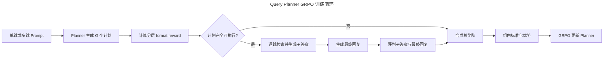

# Query Planner GRPO 算法与训练配置设计

> 本文用于训练落地和面试说明。当前内容基于 3,000 条通用多跳、1,000 条领域多跳与 1,000 条领域单跳 GRPO-ready 数据，以及 `Qwen/Qwen3-4B-Instruct-2507` 和单机 4 张 A100 的首版工程方案，不代表已经跑出的实验结果。

## 🎯 方案结论

推荐从多跳 SFT 冷启动检查点出发，先做 **LoRA GRPO**，不要直接从原始 Instruct 模型开始，也不建议第一轮就进行全参数训练。

- Planner：`Qwen/Qwen3-4B-Instruct-2507`
- 初始权重：20K 单跳 SFT 后，再训练 2K 多跳 SFT 的冷启动检查点
- 每个 Prompt 的 rollout 数：`G = 8`
- 每步 Prompt 数：`64`
- 每步候选计划数：`64 × 8 = 512`
- 训练轮数：先跑 `2 epochs`；`drop_last` 时为 156 个完整 rollout 迭代
- 核心奖励：真实执行检索与回答链路，最终答案正确性作为语义奖励的一票否决
- 格式塑形：JSON、Schema、编号和依赖格式占总奖励 10%，端到端答案效果占 90%
- 过程塑形：逐跳子答案正确率只用于区分最终答案同样正确的候选计划
- 防奖励投机：单跳样本必须保持一跳，多跳样本不得超过参考跳数，重复查询直接门控为 0
- 首轮实现：自研同步 Trainer，便于把检索执行和 reward 查清楚
- 稳定后迁移：veRL 的 FSDP2 + vLLM Hybrid Engine

Qwen3-4B-Instruct-2507 是 4B 参数、仅支持 non-thinking 模式的模型，原生上下文长度远大于本项目的规划输入需要；本项目会主动把 Prompt 和输出长度收紧，以提高 rollout 吞吐并减少无效长输出。[Qwen 官方模型卡](https://huggingface.co/Qwen/Qwen3-4B-Instruct-2507)

## 🧭 端到端训练流程



图中的监督信号已经从“生成 Query 与参考 Query 的文本相似度”，转变成“这个 Query Plan 最终能否让回答模型生成正确且有证据支持的答案”。因此，模型允许生成与参考计划措辞不同但实际有效的查询。

一次训练迭代按以下顺序执行：

1. 从 GRPO 数据中采样 64 个问题，只把 `system + instruction + input` 交给 Planner。
2. 当前旧策略对每个问题采样 8 个候选 JSON 计划，共得到 512 个 rollout。
3. 分层校验 JSON、Schema、查询编号、依赖拓扑和占位符，计算 format reward；只有完全可执行的计划才进入检索。
4. 按 `depends_on` 顺序执行计划：每一步检索证据、生成当前子问题答案，再把子答案替换进后续 Query。
5. 汇总原问题、全部检索证据和子答案，调用冻结回复模型自由生成最终回复，不提供 Gold 答案。
6. 使用规则匹配和独立 Judge 判断各子答案及最终回复；最终回复不满足 GT 或缺少证据支持时，整项语义奖励归零。
7. 将 format、最终答案门控和子答案正确率合成总奖励，同一 Prompt 的 8 个候选在组内计算相对优势。
8. 重新计算当前策略和参考策略的 token log probability，执行一次 clipped GRPO 更新。
9. 将新 LoRA adapter 同步给 rollout worker，进入下一步。

GRPO 通过同一问题下的一组候选估计相对优势，不额外训练价值模型，这是它相对 PPO 更适合本项目的一点。[DeepSeekMath / GRPO 原始论文](https://arxiv.org/abs/2402.03300)

### 数据混合与领域多跳生成

正式训练使用 5,000 条混合数据，而不是只依赖通用多跳数据：

| 数据类型 | 数量 | 比例 | 作用 |
| --- | ---: | ---: | --- |
| MuSiQue 通用多跳 | 3,000 | 60% | 保持 2～4 跳结构、实体关系与推理链多样性 |
| ConditionalQA 领域多跳 | 1,000 | 20% | 学习政策资格、条件组合与办理流程中的领域规划 |
| ConditionalQA 领域单跳 | 1,000 | 20% | 保持政策约束保真并抑制不必要拆分 |

领域多跳由 Teacher 根据 ConditionalQA 的政策证据合成新场景和新问题，而不是把原始问题强制切成多条 Query。一个生成结果必须同时提供参考计划、逐跳答案、逐跳 evidence 索引和最终参考答案，并通过以下确定性门控后才能进入正式数据集：

- 新问题不能与原始问题相同
- 计划包含 2～4 跳且至少有一条真实依赖
- 每跳答案都能在对应 evidence 中直接找到
- 每跳映射到不同的政策 Gold chunk
- 最终答案由所选证据支持，且不能泄漏进 Planner 计划
- 合成问题经过规范化指纹去重

`grpo_train.jsonl` 保留 1,000 条领域单跳和 4,000 条通用多跳，作为无 API 基线及通用多跳候选池；完成 Teacher 生成后，`grpo_train_mixed.jsonl` 才是用于正式训练的 60%/20%/20% 混合集。

### 一条数据如何进入训练

混合 GRPO-ready 数据中的一条通用多跳记录可以简化为：

```json
{
  "instruction": "Create the minimum sufficient retrieval query plan. Use one standalone query when it is sufficient; otherwise use ordered queries with explicit dependencies. Return JSON only and do not answer the question.",
  "input": "Question:\nWhen was free education introduced to the country from which Wasana originated?",
  "output": "{\"queries\":[{\"id\":\"q1\",\"query\":\"What country did Wasana originate?\",\"depends_on\":[]},{\"id\":\"q2\",\"query\":\"when was free education introduced in {{q1.answer}}\",\"depends_on\":[\"q1\"]}]}",
  "reference_answer": "1 October 1945",
  "answer_aliases": [],
  "hop_answers": ["Sri Lanka", "1 October 1945"],
  "gold_doc_ids": ["musique_91b3e7c265eedcb6", "musique_56b9e15ec9f28ae2"],
  "hop_count": 2,
  "task_type": "multi_hop",
  "namespace": "musique_aux"
}
```

Planner 在 GRPO rollout 时只能看到 `system + instruction + input`，例如：

```text
System:
You are a retrieval query planner. Return valid JSON only. Do not answer the
user's question. Preserve named entities, dates, quantities, relationships,
and eligibility constraints.

User:
Create the minimum sufficient retrieval query plan. Use one standalone query
when it is sufficient; otherwise use ordered queries with explicit dependencies.
Return JSON only and do not answer the question.

Question:
When was free education introduced to the country from which Wasana originated?
```

模型生成 8 个不同候选计划。计划执行器先检索 Wasana 的来源国家，并由回答模型生成子答案 `Sri Lanka`；随后替换 `{{q1.answer}}` 执行第二跳。所有步骤完成后，最终回复模型收到：

```text
System:
Answer the question using only the supplied evidence. Return only the short answer.

Question:
When was free education introduced to the country from which Wasana originated?

Evidence:
[候选计划实际检索出的文档片段]

Answer:
```

最终回复模型在 `Answer:` 后自由生成答案，不能看到 `reference_answer`、`hop_answers` 或 Gold 文档 ID。Reward worker 再将生成的子答案和最终回复与 GT 比较；这些 Gold 字段只进入规则评估器或 Judge，不能泄漏进 Planner、检索器或回答模型的输入。

## 🏆 Reward 设计

### 为什么不用文本相似度

文本相似度只能判断生成计划是否“像参考答案”，但无法可靠判断它是否真的检索到有效证据。例如：

- “John Locke political beliefs basis”与参考 Query 措辞不同，但可能检索效果很好。
- 一个计划可以复制参考 Query 的大部分词，却遗漏关键实体或错误连接两跳。
- 多跳问题允许多条有效检索路径，单一参考计划并不是唯一正确答案。

因此 reward 应评价计划执行后的下游回答效果，而不是表面文本重合度。

### 为什么不能继续使用 Gold token 概率

当前链路要求回答模型自由生成子答案和最终回复，没有把 Gold 答案作为 decoder 输入，因此不存在 teacher forcing 下可直接读取的 Gold token 概率。如果回复模型是 API 或只返回生成文本，甚至拿不到完整 logits。

也不建议让模型直接输出“我有 85% 把握”。这种自报置信度不是可校准概率，容易被 Prompt、措辞和模型偏好影响。没有 token 概率时，应把“正确概率”改成以下两个可落地量：

- 训练时：规则或 Judge 给出的正确性标签，再对多跳子问题求正确比例。
- 需要概率时：对同一答案进行 $K$ 次独立评判，用通过比例作为经验概率，而不是模型自报概率。

### 子答案过程奖励

设候选计划实际执行了 $H$ 个步骤，第 $j$ 个生成子答案的正确性为 $c_j \in \{0,1\}$。MuSiQue 可先使用规范化答案、数字日期归一化和 `hop_answers` 做规则判断；规则无法确定时，再调用独立 Judge。

```math
r_{\mathrm{sub}} = \frac{1}{H}\sum_{j=1}^{H}c_j
```

如果确实需要“正确概率高于阈值”的表达，可以对同一子答案做 $K$ 次独立 Judge 判定：

```math
\widehat{p}_j = \frac{1}{K}\sum_{k=1}^{K}c_{j,k}
```

例如 `K = 3` 时，至少 2 个 Judge 通过即可认为该子答案正确。但训练阶段对每个 rollout 做 3 次 Judge 成本过高，首版推荐 `K = 1`，仅在 Judge 一致性校准、验证集和争议样本上使用 `K = 3`。

### 分层 format reward

格式奖励使用确定性规则计算，不调用额外模型，也不比较生成 Query 与参考 Query 的文本相似度。将格式拆成四个二值子项：

| 子项 | 权重 | 通过条件 |
| --- | ---: | --- |
| `f_json` | 0.25 | 输出只有一个 JSON 对象，没有 Markdown、解释文字或多余前后缀，并且能够严格解析 |
| `f_schema` | 0.25 | 顶层只包含 `queries`；查询数为 1～4；每项包含类型正确的 `id/query/depends_on` |
| `f_id` | 0.25 | ID 严格为连续的 `q1...qn`，Query 是非空字符串且没有重复 ID |
| `f_dep` | 0.25 | 依赖只能指向前序步骤，依赖与 `{{qN.answer}}` 占位符完全对应，不存在自环或未来依赖 |

四项按顺序计算；如果前一层失败导致后一层无法判断，无法判断的子项按 0 计，不做宽松 JSON 修复后再评分。

```math
r_{\mathrm{fmt}} = 0.25\left(f_{\mathrm{json}} + f_{\mathrm{schema}} + f_{\mathrm{id}} + f_{\mathrm{dep}}\right)
```

只有四项全部通过时，计划才可以执行检索：

```math
g_{\mathrm{exec}} = f_{\mathrm{json}}f_{\mathrm{schema}}f_{\mathrm{id}}f_{\mathrm{dep}}
```

分层而不是单一的“合法/非法”判断，可以让接近正确格式的 rollout 获得很小的学习信号。例如能解析 JSON、但依赖占位符错误的计划仍能获得部分格式分，却不能执行检索或获得答案分。

### 最终回复如何与 GT 比较

不能只看子答案。子答案全部正确并不保证最终回复正确、完整且没有额外幻觉；反过来，最终答案也可能因为模型参数记忆或偶然猜中而正确。因此最终回复必须作为语义奖励的一票否决，同时检查其是否由本次检索证据支持。

推荐使用“规则优先、Judge 兜底”的两级评估：

| 数据类型 | 第一层规则 | 第二层 Judge |
| --- | --- | --- |
| MuSiQue 短答案 | 小写化、去标点冠词、数字和日期归一化、EM、alias 匹配 | 判断语义等价、证据支持和无矛盾 |
| 列表或多要点答案 | 规范化集合的 precision/recall | 判断必要要点是否完整、是否加入错误事实 |
| ConditionalQA 条件答案 | 不使用简单的分号字符串匹配 | 判断结论、适用条件、例外和证据是否完整 |

Judge 只输出确定性结构，例如：

```json
{
  "correct": true,
  "complete": true,
  "supported_by_retrieved_evidence": true,
  "contradiction": false
}
```

Judge 输入包含原问题、候选最终回复、GT 和该候选计划实际检索到的证据，但不需要参考 Query。最终门控定义为：

```math
g_{\mathrm{final}} = c_{\mathrm{correct}}c_{\mathrm{complete}}c_{\mathrm{supported}}\left(1-c_{\mathrm{contradiction}}\right)
```

四项均通过时 $g_{\mathrm{final}} = 1$，否则为 0。不要直接使用 Judge 自报的 0～1 置信度；若需要稳定性估计，在验证阶段用 3 次独立 Judge 的多数票。

> ⚠️ **数据前提：** ConditionalQA 的多个答案通常代表不同条件分支，不是同义别名。不能把它们压成 `yes; no` 后做字符串或概率判断；首版应只使用单一可判定答案，或把 GT 改造成保留条件的结构化 `reference_answers`。

### 防止强行拆分与查询堆叠

如果奖励只看最终回复是否命中，Planner 可能通过增加无关查询、重复召回或把单跳问题强行拆成多跳来提高偶然命中率。数据与 reward 需要共同约束这个漏洞：

- GRPO-ready 保留 1,000 条领域单跳样本，占 20%；其 `task_type = single_hop`、`hop_count = 1`。
- Planner Prompt 统一要求生成“最小充分计划”，不向模型直接透露 `task_type` 或参考 `hop_count`，避免把任务退化成按标签选择输出长度。
- 单跳候选只要生成超过一个 Query，即使最终答案命中，也将奖励门控为 0。
- 多跳候选允许少于或等于参考 `hop_count` 的有效替代路径，但超过参考跳数时奖励为 0，避免靠堆叠查询扩大召回面。
- 规范化后完全重复的 Query、无新增证据的冗余步骤或循环依赖直接记 0。
- DPO 同时提供单跳正确偏好，以及步骤遗漏、依赖断裂、步骤冗余、单步过宽、关系遗漏五类多跳负样本，让策略在进入 GRPO 前先学会“该拆才拆、拆则完整”。

设生成计划的查询数为 $n_{\mathrm{gen}}$，数据记录的参考跳数为 $n_{\mathrm{ref}}$，则首版跳数门控为：

```math
g_{\mathrm{hop}} = \mathbf{1}\left[n_{\mathrm{gen}} \le n_{\mathrm{ref}}\right]
```

最终奖励在最终回复门控之外再使用 $g_{\mathrm{hop}}$、去重门控和答案泄漏门控。这里允许多跳问题用更短但确实有效的计划，避免把参考分解误当成唯一正确路径；但不允许通过增加额外步骤骗取 reward。

### 最终奖励组合

将跳数、去重和答案泄漏等硬约束的乘积记为 $g_{\mathrm{safe}} \in \{0,1\}$。首版总奖励定义为：

```math
R = g_{\mathrm{safe}}\left[0.10r_{\mathrm{fmt}} + 0.90g_{\mathrm{exec}}g_{\mathrm{final}}\left(0.70 + 0.30r_{\mathrm{sub}}\right)\right]
```

这个设计保留了端到端目标的主导地位：

- 非 JSON 输出的总奖励为 0。
- 部分格式正确但不可执行的计划最多获得小于 0.1 的奖励。
- 格式完全正确但最终回复不通过时，最多获得 0.1，语义奖励被一票否决。
- 最终回复通过但子答案全部失败时，格式完整的总奖励为 0.73。
- 最终回复和全部子答案都通过时，总奖励为 1。
- 出现答案泄漏、跳数投机或重复查询时，`g_safe = 0`，总奖励强制归零。

外层 `0.10/0.90` 和语义奖励内部的 `0.70/0.30` 是首轮工程基线，训练期间保持固定。最终回复是门控而不是普通加权项，因此子答案再好也不能挽救错误的最终回复。

如果希望“一票否决”连格式分也清零，可以使用严格版本：

```math
R_{\mathrm{strict}} = g_{\mathrm{safe}}g_{\mathrm{exec}}g_{\mathrm{final}}\left[0.10r_{\mathrm{fmt}} + 0.90\left(0.70 + 0.30r_{\mathrm{sub}}\right)\right]
```

首轮不推荐严格版本，因为训练早期最终回复失败时所有候选都可能为 0，format reward 将失去缓解稀疏奖励的意义。建议训练使用前一公式，正式评测只看最终答案与检索指标。

### 回答模型与 Judge 的实现口径

- 回答模型全程冻结，使用固定模板和确定的证据预算，但允许按正常 decoding 自由生成。
- 每个子问题只接收该步 Query 和检索证据；最终回复接收原问题、全部子答案和实际检索证据。
- 回答模型不能看到 `reference_answer`、`hop_answers`、Gold 文档 ID 或参考计划。
- Judge 与 Planner 参数隔离，温度设为 0；首轮可以与回答模型同源但必须冻结，正式评测优先使用独立模型复核。
- Judge 一次返回所有子答案和最终回复的结构化判定，避免每一跳单独调用造成额外延迟。
- 规则能够确定 EM、alias、数字或日期答案时跳过 Judge；只把语义模糊、列表和条件答案送给 Judge。
- Planner 生成的 Query 若直接泄漏最终答案，整条 rollout 强制记 0。

### 最终门控的稀疏性问题

若某个 Prompt 的 8 个候选总奖励完全相同，组内优势全为 0，这个 Prompt 本步不能提供有效梯度。若单个候选通过最终回复门控的概率为 $p$，组内至少同时出现通过与未通过候选的概率为：

```math
P_{\mathrm{info}} = 1 - p^G - (1-p)^G
```

因此需要持续监控“零方差组比例”。推荐规则：

- 零方差组比例低于 30%：保持 `G = 8`。
- 连续多个窗口高于 40%：先检查 Judge 是否过严、回答链路是否失败，再考虑把 `G` 提高到 16。
- 最终回复通过率低于 10%：检查检索召回、回答模型、Judge 一致性，或先补充冷启动训练。
- 最终回复通过率高于 90%：检查 Judge 是否过松、规则匹配是否误判，以及回复是否真的有证据支持。

不建议继续叠加长度分、文本相似度分等大量手工奖励。首版只保留 10% 的分层格式塑形；答案泄漏、跳数上限和重复查询仍作为硬门控，最终回复与子答案链路继续占 90%。

## ⚙️ 公共训练超参数

### 推荐基线

| 类别 | 参数 | 推荐值 | 调整范围与说明 |
| --- | --- | ---: | --- |
| 模型 | Policy | Qwen3-4B-Instruct-2507 | 从多跳冷启动检查点加载 |
| 参数高效训练 | LoRA rank / alpha | 32 / 64 | 首轮不做全参数训练 |
| 参数高效训练 | LoRA dropout | 0.05 | 目标层为 `all-linear` |
| 精度 | dtype | BF16 | A100 原生支持 |
| 输入 | max prompt length | 768 | 超长样本可提高到 1024 |
| 输出 | max response length | 384 | JSON 计划通常远短于此值 |
| Rollout | Prompt batch | 64 | 每次更新的问题数 |
| Rollout | group size `G` | 8 | 稀疏时再尝试 16 |
| Rollout | candidates/update | 512 | `64 × 8` |
| 采样 | temperature | 0.7 | 与 Qwen 官方建议一致的起点 |
| 采样 | top-p / top-k | 0.8 / 20 | `min-p = 0` |
| 验证 | temperature / n | 0 / 1 | 贪心生成，便于横向比较 |
| 优化 | PPO/GRPO epochs | 1 | 同一批 rollout 只更新一轮 |
| 优化 | mini batch | 16 prompts / 128 sequences | veRL 配置填 16，乘 `G = 8` 后为 128 条序列 |
| 优化 | learning rate | `2e-6` | LoRA 扫描 `1e-6/2e-6/5e-6` |
| 优化 | Adam betas | 0.9 / 0.95 | weight decay 为 0.01 |
| 优化 | grad clip | 1.0 | 全局梯度范数 |
| 优化 | warmup | 5% | 建议 cosine decay |
| GRPO | clip ratio | 0.2 | 首轮保持常用值 |
| GRPO | entropy coefficient | 0 | 只在明显坍缩后尝试 `1e-3` |
| Reward | format / semantic 权重 | 0.10 / 0.90 | format 只做小比例塑形 |
| Reward | final / sub 权重 | 门控后 0.70 / 0.30 | final 不通过时 semantic 为 0 |
| 回答生成 | temperature | 0 | 固定回答链路，减少 reward 噪声 |
| Judge | votes | train 1 / eval 3 | 训练控制成本，验证使用多数票 |
| KL | actor KL coefficient | 0.001 | 扫描 `5e-4～5e-3` |
| KL | KL in reward | false | KL 放在 actor loss 中 |
| 损失 | aggregation | token-mean | veRL 当前最佳实践推荐 |
| 训练 | epochs | 2 | 先早停评估，再决定是否跑第 3 轮 |
| 训练 | eval / save interval | 10 / 20 steps | 约每 640 / 1,280 个 Prompt |

Qwen 官方给出的非思考模式采样建议是 `temperature = 0.7`、`top-p = 0.8`、`top-k = 20`、`min-p = 0`，这里把它作为 rollout 起点，不等于任务最优值。[Qwen 官方模型卡](https://huggingface.co/Qwen/Qwen3-4B-Instruct-2507)

veRL 的 GRPO 文档建议不把 KL 混入 reward，而是在 actor loss 中启用 KL，并以 `0.001` 作为系数起点；当前最佳实践也更推荐 `token-mean` 聚合。[veRL GRPO 文档](https://github.com/verl-project/verl/blob/main/docs/algo/grpo.md) [veRL 配置说明](https://verl.readthedocs.io/en/latest/examples/config.html)

### 组内优势

同一问题的 8 个奖励做组内标准化：

```math
A_i = \frac{r_i - \mathrm{mean}(r)}{\mathrm{std}(r) + \epsilon}
```

建议 `epsilon = 1e-6`。如果该组标准差为 0，则跳过该组的策略梯度；仍可记录格式率、答案分数和检索指标，但不要伪造优势。

### 训练规模估算

5,000 个训练 Prompt、`G = 8`、训练 2 轮时：

- 每轮有 78 个完整 batch，剩余 8 个 Prompt 构成尾批
- 推荐 `drop_last`：156 个 rollout 迭代、79,872 个计划、624 个 optimizer step
- 若保留尾批：158 个 rollout 迭代、80,000 个计划、约 626 个 optimizer step
- 若平均输出 128 token：约生成 `10.24M` 个 Planner token
- 若全部达到 384 token 上限：最坏约生成 `30.72M` 个 Planner token

当前 1/2/3/4-hop 数据的平均参考跳数约为 2.18。按不丢尾批的 80,000 个计划估算，完整链路还需要：

- 约 174,700 次子答案生成
- 80,000 次最终回复生成
- 最多 80,000 次整链 Judge；规则已明确命中的样本可以跳过

因此“rollout”现在不再只是生成 80,000 个 JSON，而是约 254,700 次回答生成，加上必要的 Judge。此前基于 teacher-forced scorer 的耗时估计不再适用。

端到端耗时最大的变量不是 4B Planner 本身，而是检索延迟、子答案与最终答案生成、Judge 判定、A100 是 40GB 还是 80GB、PCIe 还是 SXM，以及各阶段能否批处理。没有实测前，只建议用以下区间做排期：

| 条件 | 2 epochs 粗略时间 | 说明 |
| --- | ---: | --- |
| A100 80GB、本地 4B 回答与 Judge、充分批处理 | 约 12～24 小时 | 回答生成成为主要成本 |
| A100 40GB 或 PCIe、回答 micro batch 较小 | 约 18～36 小时 | KV cache 和阶段切换更受限 |
| 外部回答/Judge API | 先做 pilot | 延迟、限流和并发决定总时间 |

这些是容量规划值，不是 benchmark。先运行 `50 prompts × 4 rollouts` 验证链路和 Judge，再运行 `100 prompts × 8 rollouts` 做吞吐 pilot，分别记录 Planner、逐跳检索、子答案生成、最终回复、Judge 和反向传播耗时。正式两轮耗时按完整 pilot 外推，再增加 15%～25% 的评测与保存开销。

## 🧰 自研 Trainer 方案

### 推荐的四卡角色分配

首轮推荐角色分离，便于定位 reward 和性能问题：

| GPU | 角色 | 主要内容 |
| --- | --- | --- |
| GPU 0 | Planner rollout | vLLM，Qwen3-4B + 当前 LoRA，TP = 1 |
| GPU 1 | Answer worker A | 冻结回答模型，批量生成子答案和最终回复 |
| GPU 2 | Answer/Judge worker B | 回答副本与结构化 Judge；检索向量模型可按显存共置或转 CPU |
| GPU 3 | Learner | 当前 Policy、optimizer；adapter 关闭时复用基础权重计算 reference logprob |

完整链路中回答生成量约为 Planner 计划生成量的 3.18 倍，因此两张卡优先分配给 Answer/Judge，而不是复制两个 Planner rollout worker。Qwen3-4B 做 LoRA 时，一个 A100 足以承担 learner；参考策略可在 adapter 关闭时复用冻结基础权重。每次参数更新后只需同步 LoRA 权重给 GPU 0。

如果改成全参数 GRPO，建议切换为 4 卡 FSDP2 分阶段复用，而不是保留上面的固定角色分配。全参数训练会增加 optimizer state、梯度和全量权重同步成本，不适合作为 reward 尚未验证时的第一轮实验。

### 显存相关参数

| 参数 | A100 40GB | A100 80GB |
| --- | ---: | ---: |
| rollout `gpu_memory_utilization` | 0.50～0.58 | 0.60～0.70 |
| learner micro batch / GPU | 4 sequences | 8 sequences |
| rollout logprob micro batch / GPU | 8 | 16 |
| reference logprob micro batch / GPU | 8 | 16 |
| max tokens / learner GPU | 9,216 | 18,432 |
| gradient checkpointing | 开启 | 开启 |

NVIDIA 官方资料显示 A100 同时存在 40GB 和 80GB 版本，因此必须先确认实际卡型；上表还需要根据 Prompt 实际 token 分布做 OOM 探测。[NVIDIA A100 Datasheet](https://www.nvidia.com/content/dam/en-zz/Solutions/Data-Center/a100/pdf/nvidia-a100-datasheet-us-nvidia-1758950-r4-web.pdf)

### 自研 Trainer 的模块边界

- `RolloutEngine`：批量生成、保存 old logprob、同步 adapter。
- `PlanValidator`：输出四项 format 子分、可执行门控，以及跳数、重复查询和答案泄漏门控。
- `ChainExecutor`：按拓扑顺序调用 Retriever 和冻结回答模型，保存每跳 Query、文档、子答案和耗时。
- `FinalAnswerGenerator`：根据原问题、全部子答案和实际证据自由生成最终回复。
- `JudgeEvaluator`：规则优先、Judge 兜底，一次输出逐跳正确性与最终回复四项判定。
- `RewardManager`：合成 format、final gate、sub-answer 与硬门控，管理统计和结果缓存。
- `GRPOLearner`：组内优势、clipped loss、KL loss、反向传播和 checkpoint。
- `Evaluator`：固定验证集上的贪心计划、检索指标和答案 EM/F1。

自研方案的重点不是复刻一个通用 RL 框架，而是先保证三个项目特有环节可验证：多跳计划能否正确执行、最终回复是否被可靠判定、reward 是否真正依赖检索证据。

## 🚄 veRL 方案

### 推荐运行方式

稳定后使用 veRL 的 FSDP2 + vLLM Hybrid Engine。veRL 官方文档将 FSDP/FSDP2 定位为适合研究与原型的后端，并支持自定义同步或异步 reward function；模型型 reward 既可共置，也可使用独立资源池。[veRL 安装与后端说明](https://verl.readthedocs.io/en/latest/start/install.html) [veRL Reward Loop](https://verl.readthedocs.io/en/latest/advance/reward_loop.html)

四卡有两种部署方式：

1. **四卡 Hybrid 分阶段复用，推荐。** Actor、rollout、reference 使用 4 卡；进入 reward 阶段后释放部分 rollout KV cache，再加载或唤醒回答模型与 Judge。整体资源利用率更高，但阶段切换和显存调度更复杂。
2. **三卡 veRL + 一卡链路服务。** GPU 0～2 运行 actor/rollout，GPU 3 常驻回答模型与 Judge；检索服务放在 CPU。链路隔离清晰，适合调试，但单卡回答吞吐可能成为瓶颈。

首轮 veRL 建议在小规模数据上先验证第二种方式的接口和判定一致性；正式吞吐实验再比较两种部署。若单卡回答吞吐不足，优先使用四卡分阶段复用，或将回答/Judge 部署为独立服务资源。

### veRL 配置预估

以下是设计级参数清单，字段按当前 veRL 文档命名整理。veRL 配置键会随版本演进，正式运行时必须固定 release/commit 和官方依赖锁，并先打印完整配置核对字段。

```yaml
data:
  train_batch_size: 64
  max_prompt_length: 768
  max_response_length: 384
  prompt_key: prompt
  seed: 42

actor_rollout_ref:
  model:
    path: /path/to/qwen3-4b-multihop-cold-start
    lora_rank: 32
    lora_alpha: 64
    target_modules: all-linear
    enable_gradient_checkpointing: true
    use_remove_padding: true

  actor:
    strategy: fsdp2
    ppo_mini_batch_size: 16
    ppo_micro_batch_size_per_gpu: 4
    ppo_epochs: 1
    clip_ratio: 0.2
    entropy_coeff: 0.0
    use_kl_loss: true
    kl_loss_coef: 0.001
    kl_loss_type: low_var_kl
    loss_agg_mode: token-mean
    grad_clip: 1.0
    optim:
      lr: 2.0e-6
      weight_decay: 0.01

  rollout:
    name: vllm
    tensor_model_parallel_size: 1
    n: 8
    temperature: 0.7
    top_p: 0.8
    top_k: 20
    gpu_memory_utilization: 0.55
    log_prob_micro_batch_size_per_gpu: 8

  ref:
    log_prob_micro_batch_size_per_gpu: 8

algorithm:
  adv_estimator: grpo
  use_kl_in_reward: false

reward:
  custom_reward_function:
    path: /path/to/chain_judge_reward.py
    name: compute_score
  reward_manager:
    name: chain_judge

trainer:
  nnodes: 1
  n_gpus_per_node: 4
  total_epochs: 2
  test_freq: 10
  save_freq: 20
```

`format_weight = 0.10`、`semantic_weight = 0.90`、`final_base = 0.70`、`sub_weight = 0.30`、四项 format 子权重和硬门控属于项目自定义 reward function 的参数，不是 veRL 内置 GRPO 参数。接入时应由 `compute_score` 读取固定配置，并分别返回 format、subanswer、final、gate 和 total reward 指标用于日志聚合。

A100 80GB 时，优先把三个 micro batch 从 `4/8/8` 提高到 `8/16/16`，并将 rollout 的显存利用率从 `0.55` 提高到约 `0.65`。不要一次把所有参数拉满：先逐项增加，确保 Planner rollout 的 KV cache、训练激活、回答模型和 Judge 不会在阶段切换时共同触发 OOM。

veRL 数据需要将当前 JSONL 适配成类似以下逻辑结构：

```yaml
prompt:
  - role: system
    content: 当前记录的 system
  - role: user
    content: instruction 与 input
data_source: conditionalqa_or_musique
reward_model:
  ground_truth: reference_answer
extra_info:
  answer_aliases: []
  hop_answers: []
  gold_doc_ids: []
  hop_count: 2
  task_type: multi_hop
  namespace: musique_aux
  source_id: 2hop__...
```

`output` 只作为审计和离线对照，不作为 GRPO 交叉熵标签；`reference_answer`、`answer_aliases` 和 `gold_doc_ids` 只能进入 reward 侧，不能拼进 Planner Prompt。

## 📊 监控、停止条件与消融

### 每个训练窗口必须记录

| 层级 | 指标 | 作用 |
| --- | --- | --- |
| Rollout | JSON、Schema、ID、依赖四项通过率，单跳过拆率、重复查询率 | 发现具体格式退化与奖励投机 |
| Reward | format 均值、子答案通过率、最终答案通过率、总奖励、零方差组率 | 判断过程塑形和语义门控是否可学 |
| 最终答案 | correct、complete、supported、contradiction 的通过率 | 区分答错、漏答、无证据和自相矛盾 |
| 判定质量 | 规则覆盖率、Judge 调用率、规则与 Judge 一致率、人工抽检一致率 | 防止奖励模型本身成为噪声源 |
| 检索 | Recall@K、MRR、Joint Recall、平均查询数 | 验证 Planner 是否真正改善检索 |
| 优化 | token KL、clip fraction、梯度范数、entropy | 发现训练坍缩或更新过强 |
| 系统 | planner/retrieval/answer/judge/update 耗时、峰值显存 | 找到吞吐瓶颈 |

建议设置保护性停止条件：

- JSON 合法率低于 95% 时暂停训练并检查采样和 KL。
- format 均值上升但答案正奖励率或检索指标下降时，降低 format 权重。
- 单跳过拆率连续高于 5% 时暂停训练，检查 hop gate、采样策略和 DPO 初始化。
- 正奖励率连续低于 5% 或高于 95% 时重新校准 reward，不能继续盲跑。
- 零方差组率连续三个窗口高于 50% 时停止，检查 Judge 判定边界、样本难度或调整 `G`。
- token KL 持续异常升高时降低学习率或提高 KL 系数。
- 验证集答案指标不升、训练奖励持续上升时，优先排查 reward hacking。

### 最小消融矩阵

| 实验 | 变量 | 要回答的问题 |
| --- | --- | --- |
| R0 | 仅最终答案 0/1 reward | 只看最终结果时能否形成有效组内差异 |
| R1 | 最终答案门控 + 子答案塑形 | 过程信号能否提高多跳规划的稳定性 |
| F0/F5/F10/F20 | format 权重 0/0.05/0.10/0.20 | 格式塑形能否降低非法输出且不压制答案目标 |
| H0/H1 | 无/有跳数与去重门控 | 是否抑制强行拆分和查询堆叠 |
| G4/G8/G16 | group size | 稀疏 reward 下多少候选性价比最高 |
| J1/J3 | 单次 Judge 或三次投票 | 判定稳定性是否值得额外推理成本 |
| Same/Independent | 回答模型兼任 Judge 或独立 Judge | 是否存在自我偏好和奖励迎合 |
| LoRA/Full | 参数更新方式 | LoRA 是否已经满足收益与稳定性要求 |
| M0 | 4K 通用多跳 + 1K 领域单跳 | 不加入领域多跳时的迁移基线 |
| M1 | 3K 通用多跳 + 1K 领域多跳 + 1K 领域单跳 | 领域多跳是否改善政策任务且保持通用能力 |
| M2 | 2.5K 通用多跳 + 1.5K 领域多跳 + 1K 领域单跳 | 继续提高领域多跳比例是否值得 |

优先顺序是先比较 M0 与 M1，确认领域多跳数据本身有效；再固定数据混合和语义 reward 比较 F0 与 F10、R0 与 R1，随后测试 `G = 4/8/16` 和 J1/J3，最后才比较 M2 及 LoRA 与全参数训练。否则变量过多，很难解释提升来自哪里。

## 🗣️ 面试表达

### 60 秒回答

> 我把 GRPO reward 分成格式塑形和端到端答案效果两部分。格式部分检查 JSON 外壳、Schema、连续编号以及依赖和占位符，占总奖励 10%；只有格式可执行的计划才进入完整链路。每个候选计划都实际执行逐跳检索、子答案生成和最终答案生成，不向回答模型提供 Gold 答案。
>
> 语义部分占 90%。子答案通过规则或 Judge 与逐跳参考答案比较，形成过程塑形；最终答案再检查正确、完整、被检索证据支持且没有矛盾，并作为语义一票否决。总 reward 是 10% 格式分加 90% 语义分，其中语义分内部用 70% 最终答案基础分和 30% 子答案塑形。5K 数据训练两轮，丢弃尾批时有 156 个完整 rollout 迭代、79,872 个候选计划和 624 个 optimizer step。第一版自研 Trainer 将 Planner rollout、两路回答/Judge worker 和 learner 分到四张 A100 上，链路稳定后再迁移到 veRL。

### 高频追问

**没有 teacher forcing，最终答案怎么和 GT 比较？**

不让回答模型看到 GT，但允许 reward 侧看到 GT。短事实答案先做归一化 EM、别名匹配或集合 F1；条件性、解释性答案再由冻结的独立 Judge 输出 correct、complete、supported、contradiction 四项判定。训练默认单次 Judge；验证集和争议样本可做三次投票，把通过比例当作经验正确率，但不把模型自报置信度当概率。

**为什么答案 reward 是 0/1，但总 reward 不是纯二值？**

最终答案门控保持 0/1，直接表示最终回复是否同时满足正确、完整、有证据和无矛盾；子答案通过率是 0 到 1 的过程信号。总 reward 额外加入最多 0.1 的格式分，为训练早期的近似合法输出提供信号。格式完全正确但最终答案错误也最多拿 0.1，因此不会把任务退化成 JSON 格式训练。

**为什么 group size 选 8？**

4B 模型在四卡 A100 上生成 8 个候选的成本可控，同时比 4 个候选更有机会在二值 reward 下形成正负样本。16 个候选只在零方差组过高时启用，否则 rollout 成本会近似翻倍。

**为什么先自己写 Trainer？**

项目最难的部分不是标准 GRPO loss，而是让每个候选计划真实执行跨跳检索与回答，并保证最终答案 Judge 可靠、reward 不泄漏 GT。自研同步流程更容易逐条检查查询、证据、子答案、最终答案和判定结果；逻辑稳定后用 veRL 接管分布式调度和吞吐优化。

**为什么先 LoRA？**

当前目标是验证 reward 是否正确、是否能带来真实检索增益。LoRA 显存更小、同步更快、参考策略可以复用冻结基础权重，能够降低第一次实验的变量数量；确认收益后再做全参数训练对照。

## 📚 参考资料

- [Qwen3-4B-Instruct-2507 官方模型卡](https://huggingface.co/Qwen/Qwen3-4B-Instruct-2507)
- [DeepSeekMath：GRPO 原始论文](https://arxiv.org/abs/2402.03300)
- [veRL GRPO 配置说明](https://github.com/verl-project/verl/blob/main/docs/algo/grpo.md)
- [veRL 配置参考](https://verl.readthedocs.io/en/latest/examples/config.html)
- [veRL Reward Loop](https://verl.readthedocs.io/en/latest/advance/reward_loop.html)
- [veRL 安装和训练后端](https://verl.readthedocs.io/en/latest/start/install.html)
- [NVIDIA A100 Datasheet](https://www.nvidia.com/content/dam/en-zz/Solutions/Data-Center/a100/pdf/nvidia-a100-datasheet-us-nvidia-1758950-r4-web.pdf)
