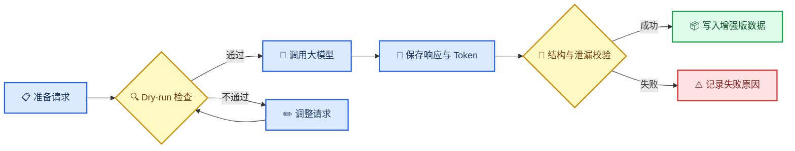

# 公共政策 Query Planner 项目面试准备

_用于梳理项目技术流程、核心难点、解决方案、项目亮点与后续面试问答。_

---

## 📋 项目定位

> 这是一个面向公共政策问答 RAG 系统的 Query Planner 数据工程与优化方案项目。核心目标不是直接生成答案，而是把复杂、口语化、上下文相关的用户问题，转化为约束完整、可以直接检索的单跳或多跳查询计划。

英国公共政策问题通常同时包含年龄、收入、居住地、工作时间、家庭关系和申请时间等条件，但政策文档通常按照政策名称、申请条件、办理流程和例外情况组织。用户表达与政策文档结构不一致，直接检索容易遗漏关键条件，也容易召回主题相似但并不适用的条款。

Query Planner 位于用户问题和检索器之间，主要承担两项任务：

- **单跳改写：** 将依赖对话上下文的问题改写为独立、紧凑且约束完整的检索 Query
- **多跳规划：** 将复杂问题拆成 2～4 个有先后依赖关系的检索步骤

## 🏗️ 端到端技术流程


### 第一阶段：明确问题与优化对象

项目没有直接优化答案生成模型，而是将 RAG 链路中的瓶颈定位为 Query Planner：

1. 用户问题可能依赖历史对话，无法直接检索
2. 政策问题包含大量资格约束，普通改写容易丢失条件
3. 复杂问题需要先获取中间事实，再执行后续检索
4. Planner 的输出必须能够被检索系统真正执行，而不只是语义上看起来合理

### 第二阶段：数据集能力分工

三个数据集承担不同职责，并非简单混合。


| 数据集            | 主要问题                 | 项目中的作用                         |
| ------------------- | -------------------------- | -------------------------------------- |
| **QReCC**         | 对话问题存在指代和省略   | 学习上下文消解与独立查询改写         |
| **ConditionalQA** | 政策问题包含密集资格约束 | 学习政策领域约束保真并构建政策知识库 |
| **MuSiQue**       | 问题需要多步推理         | 学习 2～4 跳问题拆解与依赖规划       |

可以用一句话概括：

> QReCC 教模型“把话说完整”，ConditionalQA 教模型“不要遗漏政策条件”，MuSiQue 教模型“先查什么、后查什么”。

### 第三阶段：构建政策知识库

ConditionalQA 的政策文档包含 HTML 和多级标题，处理流程包括：

1. 清除 HTML 标签、异常空格和无效字符
2. 保留标题层级，避免正文失去政策语境
3. 根据章节与长度切分文档
4. 合并过短的尾部文本块
5. 为知识块生成稳定 ID 和内容指纹
6. 将官方 evidence 映射到对应知识块，形成可评测的 Gold 文档 ID

当前产物包括 652 篇原始政策文档和 12,552 个政策知识块。官方 evidence 的映射覆盖率约为 99.99%。这里的 99.99% 表示几乎所有 evidence 都找到了候选知识块，不能表述为经过人工核验的映射准确率。

MuSiQue 段落则经过规范化和去重，形成独立的 `musique_aux` 知识库命名空间，避免与政策语料混用。

### 第四阶段：构建基础 SFT 与多跳冷启动数据

SFT 分为两个连续阶段。第一阶段保留原有的 20,000 条单跳基础 SFT，让模型掌握输入对话历史、场景和当前问题后输出结构化查询计划的基本任务，而不是直接回答问题。

20,000 条基础 SFT 的组成保持不变：


| 类型                   |   数量 | 作用                       |
| ------------------------ | -------: | ---------------------------- |
| QReCC 非平凡改写       | 14,130 | 学习指代消解和独立问题改写 |
| QReCC no-op            |  3,532 | 抑制不必要的过度改写       |
| ConditionalQA 政策样本 |  2,338 | 补充政策实体和资格约束     |

no-op 样本很重要：如果所有训练样本都要求明显改写，模型可能形成“为了改写而改写”的习惯，甚至向已经完整的问题中引入不存在的信息。

基础 SFT 主要建立四项能力：

- 输出格式合法
- 正确消解上下文指代
- 将问题改写成独立 Query
- 初步保留实体和关键约束

第二阶段额外构建 2,000 条 MuSiQue 多跳 SFT 冷启动数据，不挤占上述 20,000 条基础数据。冷启动集严格按跳数分层抽样：

| 跳数 | 数量 | 训练重点 |
| ---- | ---: | -------- |
| 2-hop | 1,000 | 学习基本的前后查询依赖 |
| 3-hop | 600 | 学习连续传递中间答案 |
| 4-hop | 400 | 学习更长计划的顺序与结构稳定性 |

冷启动的目的不是直接优化检索奖励，而是先让模型通过标准答案学会多跳拆分、`depends_on` 关系和答案占位符。这样进入 GRPO 时，模型主要探索“哪种计划带来更好的检索结果”，而不必同时从零学习输出格式和任务定义。

### 第五阶段：构建 DPO 偏好数据

SFT 能告诉模型正确输出是什么，但未必能让模型区分那些“表面合理、实际降低检索质量”的查询。因此，项目构建了 5,000 组 DPO 偏好数据，每组包含一个正确计划和一个困难负样本。

五类负样本各 1,000 条：


| 错误类型     | 典型表现                       | 训练目标           |
| -------------- | -------------------------------- | -------------------- |
| 指代未消解   | 仍保留“他”“它”“这个政策” | 强化上下文消解     |
| 核心实体遗漏 | 删除人名、政策名或关系         | 强化实体保真       |
| 关键约束遗漏 | 删除年龄、金额、时间或状态     | 强化资格条件保真   |
| 查询过于宽泛 | 将具体问题改成泛化主题         | 强化查询聚焦能力   |
| 错误上下文   | 引入历史中的错误实体或条件     | 强化上下文选择能力 |

负样本仍然保持结构合法、语言自然和表面合理，避免模型只学会识别乱码或非法 JSON。

### 第六阶段：构建 GRPO-ready 多跳数据

项目从多跳 SFT 冷启动集之外的 MuSiQue 样本中构建 5,000 条多跳数据，保留：

- 2、3或4跳的查询数量
- 每一步查询和步骤顺序
- 查询之间的依赖关系
- 每一跳的参考答案
- Gold 文档 ID
- 最终参考答案

数据整理时先完成 2,000 条冷启动集抽样，再从剩余候选中抽取 GRPO-ready 集。两者同时按照 MuSiQue 来源 ID 和规范化问题指纹去重，要求交集均为零，防止 GRPO 样本在监督冷启动阶段被提前看到。

例如，一个问题需要先查询人物出生地，再查询该地点所属的行政区：

```text
q1：查询某人物的出生地
q2：查询 q1 返回的地点属于哪个行政区
```

Planner 的结构契约要求：

- 查询数量只能是 1～4 条
- 查询编号必须按顺序出现
- 后续查询只能依赖已经执行的前序查询
- 声明依赖后，查询中必须使用对应的前序答案占位符
- 输出只包含查询计划，不能夹带最终答案

需要准确说明：当前产物是 **GRPO-ready/reference 数据**，并不等于已经完成 GRPO 训练。

### 第七阶段：可选大模型数据增强

本地规则能够稳定构造数据，但政策 Query 和负样本的自然性仍有提升空间。因此项目设计了可选的大模型增强流程：



该流程支持断点续跑，并分别保存原始响应、解析结果、Token 用量和失败原因。只有校验成功的响应才进入新的增强版数据文件，原始基线不会被覆盖。

### 第八阶段：后续训练方案

优化后的训练与对照实验路径是：

```text
基础模型
  ↓
20K 单跳基础 SFT：学习格式、上下文消解和约束保真
  ↓
2K MuSiQue 多跳 SFT 冷启动：学习 2～4 跳拆分与依赖
  ↓
共享冷启动检查点
  ├─ DPO：强化查询偏好与约束保真
  └─ GRPO：面向多跳检索收益进行优化
```

为了公平比较 DPO 和 GRPO，需要控制以下变量：

- 使用相同的基础模型和多跳冷启动检查点
- 使用相近的训练数据规模
- 使用相同的推理参数
- 使用相同的知识库和检索器
- 使用相同的官方评测集

评测时保留四个检查点：基础 SFT、冷启动、DPO 和 GRPO。基础 SFT 与冷启动的差值衡量多跳监督预热的独立贡献；DPO 与 GRPO 都相对同一冷启动检查点比较，避免把“是否见过多跳格式”误当成后训练算法收益。

### 第九阶段：RAG 联调与分层评测

后续完整系统可以由 Planner、Embedding 模型、向量检索器和答案生成器组成。评测不能只看 Planner 输出是否“像一个好查询”，而要分三层验证。


| 评测层级   | 核心指标                                                       | 回答的问题               |
| ------------ | ---------------------------------------------------------------- | -------------------------- |
| Planner 层 | JSON 合法率、约束覆盖率、依赖正确率                            | 查询计划本身是否正确     |
| 检索层     | Gold-document Recall@K、Evidence Recall@K、MRR、Joint Recall@K | 计划是否真正找到正确证据 |
| 回答层     | Exact Match、F1、不可回答识别                                  | 最终答案是否得到提升     |

上述三层指标需要在基础 SFT、冷启动、DPO 和 GRPO 四个检查点上使用同一评测配置计算。当前仓库尚未完成正式训练和评测，因此不预填 Recall 或 F1 数值。

## 📥 输入输出与 Prompt 用例

这部分用于回答面试中最常见的追问：**模型到底接收什么，输出什么，训练数据又是什么样？**

首先需要区分三层内容：


| 层级                 | 输入                              | 输出                       | 作用                      |
| ---------------------- | ----------------------------------- | ---------------------------- | --------------------------- |
| 原始数据层           | 对话、场景、问题、证据            | 规范化样本                 | 提供监督信息和评测依据    |
| Teacher 数据生成层   | 原始样本与生成规则                | 高质量查询计划或困难负样本 | 构造或增强训练标签        |
| Planner 训练与推理层 | System Prompt、任务指令、用户输入 | 结构化查询计划             | 真正供 Planner 学习和执行 |

> 📌 **说明：** 以下示例为方便面试讲解进行了字段精简，但数据结构、Prompt 目标和输出约束与项目保持一致。

### 数据与输出协议

#### Planner 的统一输出协议

无论是单跳还是多跳，Planner 都返回同一种 JSON 结构：

```json
{
  "queries": [
    {
      "id": "q1",
      "query": "retrieval query",
      "depends_on": []
    }
  ]
}
```

三个字段分别表示：

- `id`：查询步骤编号，范围为 `q1` 到 `q4`
- `query`：真正发送给检索器的查询文本
- `depends_on`：当前查询依赖的前序步骤

单跳查询的 `depends_on` 为空；多跳查询通过 `{{q1.answer}}` 等占位符引用前序检索结果。

#### 原始政策数据示例

ConditionalQA 提供政策标题、用户场景、问题、参考答案和证据。清洗后的代表性样本如下：

```json
{
  "id": "policy_example_001",
  "title": "Statutory Paternity Pay and Leave",
  "scenario": "I have worked for my employer for two months and my partner is due in twenty weeks.",
  "question": "Will I qualify for paternity leave?",
  "answers": [
    "Reference answer for evaluation"
  ],
  "evidences": [
    "Reference policy evidence used for document mapping"
  ],
  "gold_doc_ids": [
    "policy_example_chunk"
  ]
}
```

这里不会直接把参考答案交给 Planner。答案和 evidence 主要用于构造标签、检查答案泄漏和评估检索效果。

### 单跳数据与 Prompt

#### SFT 的训练 Prompt

Planner 的 System Prompt 负责定义长期不变的角色和硬约束：

```text
You are a retrieval query planner. Return valid JSON only.
Do not answer the user's question. Preserve named entities, dates,
quantities, relationships, and eligibility constraints.
```

任务指令负责说明当前训练目标：

```text
Rewrite the current question as a standalone retrieval query.
Return a JSON query plan only and do not answer the question.
```

用户输入为场景与当前问题：

```text
Scenario:
I have worked for my employer for two months and my partner is due in twenty weeks.

Question:
Will I qualify for paternity leave?
```

期望输出为：

```json
{
  "queries": [
    {
      "id": "q1",
      "query": "Statutory paternity leave eligibility two months employment partner due in twenty weeks",
      "depends_on": []
    }
  ]
}
```

这个例子体现了三个关键点：模型没有直接回答“是否符合资格”，而是保留了政策名称、两个月工作时间和二十周后生产等检索约束，并将口语问题改写成独立 Query。

#### 对话改写 SFT 数据示例

QReCC 样本主要训练上下文消解。最终训练记录可以概括为：

```json
{
  "instruction": "Rewrite the current question as a standalone retrieval query. Return a JSON query plan only and do not answer the question.",
  "input": "Conversation history:\nUser: What happened with The Verve in 1995?\nAssistant: They recorded A Northern Soul.\n\nCurrent question:\nDid the album have any other style of music?",
  "output": "{\"queries\":[{\"id\":\"q1\",\"query\":\"Did The Verve album A Northern Soul have any other style of music?\",\"depends_on\":[]}]}",
  "system": "You are a retrieval query planner. Return valid JSON only. Do not answer the user's question."
}
```

原问题中的 `the album` 依赖历史对话，改写后明确为 `The Verve album A Northern Soul`，使查询脱离对话历史后仍能独立执行。

#### Teacher 数据生成 Prompt 示例

对于政策领域样本，Teacher Prompt 用于生成更自然、更高质量的训练标签。其核心内容可以概括为：

```text
Task:
Rewrite the user's policy question into one compact, standalone retrieval query.

Requirements:
1. Preserve every eligibility-changing constraint.
2. Resolve references from the scenario.
3. Return exactly one JSON object.
4. Do not answer the policy question.
5. Do not invent facts or copy answer-only information.
6. Keep the query concise and independently searchable.

Input:
Policy title: Statutory Paternity Pay and Leave
Scenario: I have worked for my employer for two months and my partner is due in twenty weeks.
Question: Will I qualify for paternity leave?
```

需要强调：Teacher 可以看到用于质量控制的辅助信息，但最终 Planner 的用户输入不会包含参考答案。生成结果还需要经过 JSON 结构、依赖关系和答案泄漏检查，不能直接进入训练集。

### DPO 偏好数据示例

DPO 的输入仍然是对话历史和当前问题，区别在于监督信号由单个正确答案变为一组 `chosen/rejected`：

> 📌 **存储格式：** 实际 JSONL 中的 `chosen` 和 `rejected` 是序列化后的 JSON 字符串。下面将其展开成对象，以便直观看出查询之间的差别。

```json
{
  "input": "Conversation history:\nUser: What was Sam Houston's role in the Texas Revolution?\n...\n\nCurrent question:\nWas he revered as a war hero?",
  "chosen": {
    "queries": [
      {
        "id": "q1",
        "query": "Was Sam Houston revered as a war hero?",
        "depends_on": []
      }
    ]
  },
  "rejected": {
    "queries": [
      {
        "id": "q1",
        "query": "Was he revered as a war hero?",
        "depends_on": []
      }
    ]
  },
  "error_type": "unresolved_reference"
}
```

`chosen` 和 `rejected` 都是合法 JSON，差别只在于后者保留了无法独立检索的代词 `he`。这能迫使模型学习检索质量差异，而不是只判断输出格式。

### 多跳 SFT 冷启动 Prompt 与输出示例

多跳冷启动任务要求模型将一个问题拆成可以顺序执行的查询。其 Prompt 和标准输出也构成后续 GRPO-ready 数据的参考计划，但两阶段使用不同的 MuSiQue 样本：

```text
Task:
Decompose the multi-hop question into two to four ordered retrieval queries.
Later queries may depend on answers from earlier queries.

Hard rules:
1. Use sequential ids q1, q2, q3, q4 without gaps.
2. Dependencies may only refer to earlier queries.
3. Every dependency must appear as a placeholder in the query text.
4. Do not answer the final question.

Question:
Jed Hansen's birthplace is in what county?
```

期望输出为：

```json
{
  "queries": [
    {
      "id": "q1",
      "query": "Jed Hansen place of birth",
      "depends_on": []
    },
    {
      "id": "q2",
      "query": "{{q1.answer}} located in which county",
      "depends_on": [
        "q1"
      ]
    }
  ]
}
```

实际执行时，检索器先执行 `q1`。假设得到 `Tacoma`，系统再把 `{{q1.answer}}` 替换为 `Tacoma`，执行第二次检索：

```text
Tacoma located in which county
```

最终检索到 `Pierce County` 后，答案生成器再结合两跳证据回答原问题。Planner 本身始终只负责规划，不负责输出最终答案。

对应的冷启动训练记录还会保留 `source_id`、`hop_count`、`namespace` 和 `sample_type` 等来源字段，用于验证 2/3/4-hop 配额，并与 GRPO-ready 数据进行 ID 和问题指纹交集检查。GRPO-ready 记录在此基础上额外保留逐跳参考答案、Gold 文档和最终参考答案，供后续 reward 计算使用。

### 推理阶段的完整输入输出

线上推理时，Planner 实际接收的是 System Prompt 与用户问题的组合：

```text
[System]
You are a retrieval query planner. Return valid JSON only.
Do not answer the user's question. Preserve named entities, dates,
quantities, relationships, and eligibility constraints.

[User]
Scenario:
I have worked for my employer for two months and my partner is due in twenty weeks.

Question:
Will I qualify for paternity leave?
```

Planner 输出结构化计划，系统解析后只将其中的 `query` 字段交给检索器：

```text
Planner JSON → 提取 Query → 检索政策知识库 → 返回证据 → 生成最终答案
```

面试中可以这样总结输入输出设计：

> Planner 输入的是“上下文或场景加当前问题”，输出的是“可执行的 JSON 查询计划”，而不是答案。训练时先用单跳基础 SFT 学会改写，再用多跳 SFT 冷启动学会拆分和依赖；随后从同一冷启动检查点分别进行 DPO 与 GRPO，其中 GRPO-ready 数据保留逐跳答案和 Gold 文档等奖励计算依据。

## 🧩 核心难点与解决思路

### 难点一：异构数据集无法直接对齐

三个数据集的输入、输出和任务目标不同。解决思路是先将 Planner 能力拆成上下文消解、政策约束保真和多跳规划，再让每个数据集承担明确职责，最后统一为相同的结构化查询计划。

### 难点二：Evidence 与切分后知识块无法天然对齐

文档切分会改变证据粒度，官方 evidence 还可能包含 HTML、跨段文本或纯标题。项目将候选范围限定在 Gold 来源文档内，先进行文本规范化与包含匹配，再用相似度方法兜底，对无法映射的样本单独记录。

### 难点三：负样本需要“错得合理”

乱码或非法 JSON 不能教会模型判断检索质量。因此，负样本保持结构正确，只在人类容易忽略、但会影响召回的关键位置犯错，并按照五种失败模式保持均衡。

### 难点四：多跳计划必须能够真正执行

生成多个 Query 并不等于多跳规划。项目显式表示步骤依赖，并要求后续查询引用前序答案，从而将自然语言分解转化为检索器可以顺序执行的计划。

### 难点五：GRPO 前的多跳能力冷启动

如果模型只完成单跳 SFT 就直接进入多跳 GRPO，它需要同时探索任务格式、查询拆分、依赖关系和奖励目标，容易出现奖励稀疏和结构不稳定。项目因此加入 2,000 条 MuSiQue 多跳 SFT 冷启动数据，使模型先掌握 2～4 跳规划的基本行为，再由 GRPO 优化实际检索收益。

### 难点六：避免数据泄漏并保证可复现

项目固定上游数据版本和随机种子，记录文件校验值，隔离官方开发集与测试集，并通过 ID 和规范化内容指纹检查重复。针对同源的 MuSiQue 冷启动集与 GRPO-ready 集，还同时检查来源 ID 和问题指纹，要求两者零重叠。同时保留本地基线与 API 增强版本，避免数据处理过程不可追溯。

## ✨ 项目亮点

1. **问题定位明确：** 没有泛化地优化整个 RAG，而是将瓶颈定位为 Query Planner
2. **数据设计有职责：** 三类数据分别对应上下文消解、政策约束和多跳规划
3. **训练衔接稳定：** 在强化学习前加入多跳监督冷启动，降低格式、拆分和奖励同时探索的难度
4. **数据隔离严格：** 冷启动与 GRPO-ready 数据按来源 ID 和问题指纹保持零重叠
5. **输出具有可执行性：** Planner 生成的是带依赖关系的结构化计划，而非自由文本
6. **负样本具有业务意义：** 五类错误对应真实检索失败模式，便于诊断和消融
7. **评测关注真实收益：** 对基础 SFT、冷启动、DPO、GRPO 四个检查点开展分层评测
8. **工程过程可追溯：** 包含版本固定、内容指纹、泄漏检查、断点续跑和基线隔离

## 🎤 两分钟口述稿

> 这个项目面向英国公共政策问答场景。这个场景的核心问题是，用户问题往往包含年龄、收入、家庭关系和时间等复杂约束，但政策文档按照政策名称、申请条件和办理流程组织，直接检索很容易遗漏关键条件。
>
> 因此，我没有直接优化答案生成模型，而是把重点放在 RAG 前端的 Query Planner 上，让它负责将上下文相关的问题改写成独立查询，并把复杂问题拆分成 2～4 个带依赖关系的检索步骤。
>
> 数据方面，我分别使用 QReCC 学习指代消解，使用 ConditionalQA 学习政策约束保真，使用 MuSiQue 学习多跳问题分解。我保留了 20,000 条单跳基础 SFT，另外按 1,000/600/400 的配额构建 2,000 条 2/3/4-hop 多跳 SFT 冷启动数据，再从剩余 MuSiQue 样本中抽取 5,000 条 GRPO-ready 数据，并用来源 ID 和问题指纹保证两者零重叠。
>
> 训练方案上，先完成单跳基础 SFT，再进行多跳冷启动，然后从同一个冷启动检查点分别开展 DPO 和 GRPO。DPO 使用五类困难负样本强化约束保真，GRPO 则计划直接优化多跳检索收益。多跳计划通过显式依赖和答案占位符保证可以被检索器实际执行。
>
> 工程上，我加入了数据版本固定、内容指纹、官方测试集隔离、结构校验、答案泄漏检查和 API 断点续跑。整个项目的重点，是把 Query Planner 从自由文本生成任务，转化为可训练、可执行、可评测的数据工程问题。

## ⚠️ 项目边界与表达口径

### 当前已经完成

- 数据下载、清洗和知识库构建
- 20,000 条单跳基础 SFT 数据构建
- 2,000 条多跳 SFT 冷启动数据构建及 2/3/4-hop 配额控制
- DPO 和 GRPO-ready 数据构建
- 冷启动集与 GRPO-ready 集的来源 ID、问题指纹零重叠校验
- Planner 结构与依赖关系校验
- 数据数量、分布和泄漏检查
- 数据探索分析与报告
- 可选的大模型数据增强流程设计与实现

### 当前尚未形成可复核结果

- Qwen3-8B LoRA 训练
- DPO 与 GRPO 正式训练
- GRPO reward 实现
- BGE-M3 与 FAISS 检索链路
- 答案生成和端到端评测
- Recall、F1 和消融实验结果

> ⚠️ **面试表达：** 在训练日志、模型权重和评测产物能够复现之前，不应将规划中的 Recall、F1 或 JSON 合法率作为已经完成的实验结果。当前最准确的项目名称是“公共政策 Query Planner 数据工程与训练评测方案设计”。

## 💬 高频追问与回答原则


| 面试官追问                   | 回答原则                                                                   |
| ------------------------------ | ---------------------------------------------------------------------------- |
| 这是真正的 GRPO 数据吗？     | 当前是 GRPO-ready/reference 数据，尚未完成 reward 与训练                   |
| 为什么需要多跳冷启动？       | 先用监督信号学习拆分、依赖与格式，降低 GRPO 奖励稀疏和结构探索难度        |
| 冷启动会泄漏 GRPO 样本吗？   | 两个集合按来源 ID 和规范化问题指纹隔离，要求交集均为零                     |
| 负样本真的足够困难吗？       | 规则版保证错误类型和结构平衡，但 hardness 仍需检索下降或人工抽检证明       |
| 99.99% 是否代表映射准确率？  | 不是，它表示 evidence 映射覆盖率，仍需人工抽样验证 precision               |
| 为什么多跳数据来自 MuSiQue？ | ConditionalQA 缺少显式逐跳监督，因此先学习规划结构，但需要承认存在领域差距 |
| 数据泄漏是否完全消除？       | 已进行 ID 和精确内容指纹检查，但近重复和语义泄漏仍需进一步检测             |
| 为什么叫 DAG？               | 输出支持前序依赖，但当前主要是有序多跳计划，不应夸大为通用图规划引擎       |

## 📝 后续面试问答记录

后续每个问题按照以下模板追加：

### 问题 1：SFT 和 DPO 是否都是单跳问题？

**面试问题：**

这里的 SFT 和 DPO 数据是否都只处理单跳问题？

**推荐口述答案：**

需要分开回答。原有的 20,000 条基础 SFT 和 5,000 组 DPO 都以单跳 Query Rewrite 为主，每条计划只有一个 `q1`，`depends_on` 为空。基础 SFT 训练指代消解、独立问题改写、政策约束保留和 JSON 格式；DPO 则通过正确查询与五类困难负样本，继续学习哪些细微错误会降低检索质量。

但优化后的完整 SFT 流程不再只有单跳。项目额外加入 2,000 条 MuSiQue 多跳 SFT 冷启动数据，其中 2-hop、3-hop、4-hop 分别为 1,000、600、400 条。模型先完成 20K 单跳基础 SFT，再用这 2K 样本学习多跳拆分、依赖关系和答案占位符，然后从同一个冷启动检查点分别进入 DPO 与 GRPO。

5,000 条 GRPO-ready 数据从冷启动集之外的 MuSiQue 样本中抽取，并通过来源 ID 和规范化问题指纹保证零重叠。这样既避免监督阶段提前看到强化学习样本，也能让 GRPO 把探索重点放在真实检索收益上，而不是从零学习多跳格式。需要注意，DPO 当前仍是单跳数据设计，但这不代表 DPO 方法本身只能处理单跳任务。

**可能追问：**

- 为什么将多跳数据做成独立冷启动集，而不是混入 20K 基础 SFT？
- DPO 能不能训练多跳偏好？
- 如何证明冷启动集与 GRPO-ready 集没有重叠？
- 为什么多跳阶段选择 GRPO，而不是继续使用 SFT？

**回答关键词：**

- 20K 基础 SFT 和 5K DPO 以单跳为主
- 额外 2K 多跳 SFT 冷启动，2/3/4-hop 为 1,000/600/400
- 基础 SFT → 冷启动 → 共享检查点 → DPO/GRPO
- 冷启动与 GRPO-ready 按来源 ID 和问题指纹零重叠
- 方法能力不等于当前数据设计

**表达风险：**

- 不要说 SFT 或 DPO 天生只能处理单跳任务
- 不要将 GRPO-ready 数据表述为已经完成 GRPO 训练
- 不要把 2K 冷启动数据算进原有 20K 单跳基础 SFT
- 不要说 DPO 与 GRPO 从基础 SFT 直接分支；两者共享的是多跳冷启动后的检查点

## 📚 项目内参考

- [项目说明](../README.md)
- [项目背景](../background.md)
- [简历描述](../resume.md)
- [数据清洗与 EDA 报告](../data/reports/eda_report.md)
