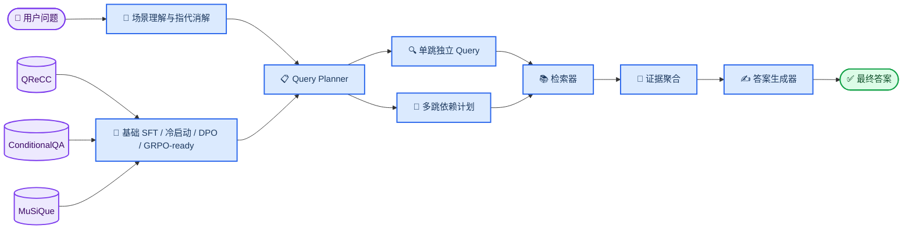
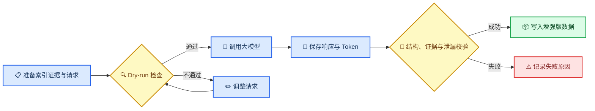

# 公共政策 Query Planner 项目面试准备

_用于梳理项目技术流程、核心难点、解决方案、项目亮点与后续面试问答。_

---

## 📋 项目定位

> 这是一个面向公共政策问答 RAG 系统的 Query Planner 数据工程与优化方案项目。核心目标不是直接生成答案，而是把复杂、口语化、上下文相关的用户问题，转化为约束完整、可以直接检索的单跳或多跳查询计划。

英国公共政策问题通常同时包含年龄、收入、居住地、工作时间、家庭关系和申请时间等条件，但政策文档通常按照政策名称、申请条件、办理流程和例外情况组织。用户表达与政策文档结构不一致，直接检索容易遗漏关键条件，也容易召回主题相似但并不适用的条款。

Query Planner 位于用户问题和检索器之间，主要承担两项任务：

- **单跳改写：** 将依赖对话上下文的问题改写为独立、紧凑且约束完整的检索 Query
- **多跳规划：** 将复杂问题拆成 2～4 个有先后依赖关系的检索步骤

## 🏗️ 端到端技术流程



### 第一阶段：明确问题与优化对象

项目没有直接优化答案生成模型，而是将 RAG 链路中的瓶颈定位为 Query Planner：

1. 用户问题可能依赖历史对话，无法直接检索
2. 政策问题包含大量资格约束，普通改写容易丢失条件
3. 复杂问题需要先获取中间事实，再执行后续检索
4. Planner 的输出必须能够被检索系统真正执行，而不只是语义上看起来合理

### 第二阶段：数据集能力分工

三个数据集承担不同职责，并非简单混合。


| 数据集            | 主要问题                 | 项目中的作用                         |
| ------------------- | -------------------------- | -------------------------------------- |
| **QReCC**         | 对话问题存在指代和省略   | 学习上下文消解与独立查询改写         |
| **ConditionalQA** | 政策问题包含密集资格约束 | 学习政策领域约束保真并构建政策知识库 |
| **MuSiQue**       | 问题需要多步推理         | 学习 2～4 跳问题拆解与依赖规划       |

可以用一句话概括：

> QReCC 教模型“把话说完整”，ConditionalQA 教模型“不要遗漏政策条件”，MuSiQue 教模型“先查什么、后查什么”。

### 第三阶段：构建政策知识库

ConditionalQA 的政策文档包含 HTML 和多级标题，处理流程包括：

1. 清除 HTML 标签、异常空格和无效字符
2. 保留标题层级，避免正文失去政策语境
3. 根据章节与长度切分文档
4. 合并过短的尾部文本块
5. 为知识块生成稳定 ID 和内容指纹
6. 将官方 evidence 映射到对应知识块，形成可评测的 Gold 文档 ID

当前产物包括 652 篇原始政策文档和 12,552 个政策知识块。官方 evidence 的映射覆盖率约为 99.99%。这里的 99.99% 表示几乎所有 evidence 都找到了候选知识块，不能表述为经过人工核验的映射准确率。

MuSiQue 段落则经过规范化和去重，形成独立的 `musique_aux` 知识库命名空间，避免与政策语料混用。

### 第四阶段：构建基础 SFT 与多跳冷启动数据

SFT 分为两个连续阶段。第一阶段保留原有的 20,000 条单跳基础 SFT，让模型掌握输入对话历史、场景和当前问题后输出结构化查询计划的基本任务，而不是直接回答问题。

20,000 条基础 SFT 的组成保持不变：


| 类型                   |   数量 | 作用                       |
| ------------------------ | -------: | ---------------------------- |
| QReCC 非平凡改写       | 14,130 | 学习指代消解和独立问题改写 |
| QReCC no-op            |  3,532 | 抑制不必要的过度改写       |
| ConditionalQA 政策样本 |  2,338 | 补充政策实体和资格约束     |

no-op 样本很重要：如果所有训练样本都要求明显改写，模型可能形成“为了改写而改写”的习惯，甚至向已经完整的问题中引入不存在的信息。

基础 SFT 主要建立四项能力：

- 输出格式合法
- 正确消解上下文指代
- 将问题改写成独立 Query
- 初步保留实体和关键约束

第二阶段额外构建 2,000 条 MuSiQue 多跳 SFT 冷启动数据，不挤占上述 20,000 条基础数据。冷启动集严格按跳数分层抽样：


| 跳数  |  数量 | 训练重点                       |
| ------- | ------: | -------------------------------- |
| 2-hop | 1,000 | 学习基本的前后查询依赖         |
| 3-hop |   600 | 学习连续传递中间答案           |
| 4-hop |   400 | 学习更长计划的顺序与结构稳定性 |

冷启动的目的不是直接优化检索奖励，而是先让模型通过标准答案学会多跳拆分、`depends_on` 关系和答案占位符。这样进入 GRPO 时，模型主要探索“哪种计划带来更好的检索结果”，而不必同时从零学习输出格式和任务定义。

### 第五阶段：构建 DPO 偏好数据

SFT 能告诉模型正确输出是什么，但未必能让模型区分那些“表面合理、实际降低检索质量”的计划。因此，项目构建了 5,000 组 DPO 偏好数据：2,500 条单跳与 2,500 条多跳，每组包含一个正确计划和一个结构合法的困难负样本。

单跳和多跳各设置五类错误，每类 500 条：


| 错误类型     | 典型表现                       | 训练目标           |
| -------------- | -------------------------------- | -------------------- |
| 指代未消解   | 仍保留“他”“它”“这个政策” | 强化上下文消解     |
| 核心实体遗漏 | 删除人名、政策名或关系         | 强化实体保真       |
| 关键约束遗漏 | 删除年龄、金额、时间或状态     | 强化资格条件保真   |
| 查询过于宽泛 | 将具体问题改成泛化主题         | 强化查询聚焦能力   |
| 错误上下文   | 引入历史中的错误实体或条件     | 强化上下文选择能力 |

| 多跳错误类型 | 典型表现 | 训练目标 |
| --- | --- | --- |
| 步骤遗漏 | 删除完成推理所需的一跳 | 强化计划完整性 |
| 依赖断裂 | 后续 Query 不再引用前序答案 | 强化依赖正确性 |
| 步骤冗余 | 重复已执行的查询 | 抑制无效拆分 |
| 单步过宽 | 将一个关键步骤泛化为主题查询 | 强化逐跳聚焦能力 |
| 关系遗漏 | 删除连接两个实体的关键关系 | 强化多跳语义链 |

负样本仍然保持结构合法、语言自然和表面合理，避免模型只学会识别乱码或非法 JSON。

### 第六阶段：构建单跳/多跳 GRPO-ready 数据

正式的 5,000 条 GRPO-ready 数据采用三类混合：3,000 条 MuSiQue 通用多跳、1,000 条 ConditionalQA 合成领域多跳和 1,000 条 ConditionalQA 领域单跳，比例为 60%/20%/20%。三类数据分别负责保持通用规划结构、补充政策领域推理链，以及抑制简单政策问题的过度拆分。记录保留：

- 2、3或4跳的查询数量
- 每一步查询和步骤顺序
- 查询之间的依赖关系
- 每一跳的参考答案
- 每一跳的 evidence 索引
- Gold 文档 ID
- 最终参考答案

数据整理时先为 MuSiQue 多跳 SFT、DPO 和 GRPO 候选池分配互不重叠的来源，正式 GRPO 集再从 4,000 条通用多跳候选中分层抽取 3,000 条。领域多跳不是把原始 ConditionalQA 问题机械拆开，而是由 Teacher 根据至少两个独立政策 Gold chunk 合成新的场景、问题、参考计划、逐跳答案和 evidence 索引。生成结果必须满足：新问题不同于原问题、每跳答案由对应 evidence 支持、每跳映射不同 Gold chunk、计划至少包含一条真实依赖，并且最终答案没有泄漏进 Query。

GRPO reward 由 10% 的分层格式塑形和 90% 的端到端答案效果组成。格式部分分别检查 JSON、Schema、连续编号以及依赖与占位符；只有完全可执行的计划才计算答案奖励。此外还使用 `task_type`、参考 `hop_count` 和 Query 去重门控：单跳样本生成多条 Query、多跳样本超过参考跳数、或计划中存在重复查询时，总奖励直接归零。

例如，一个问题需要先查询人物出生地，再查询该地点所属的行政区：

```text
q1：查询某人物的出生地
q2：查询 q1 返回的地点属于哪个行政区
```

Planner 的结构契约要求：

- 查询数量只能是 1～4 条
- 查询编号必须按顺序出现
- 后续查询只能依赖已经执行的前序查询
- 声明依赖后，查询中必须使用对应的前序答案占位符
- 输出只包含查询计划，不能夹带最终答案

需要准确说明：当前产物是 **GRPO-ready/reference 数据**，并不等于已经完成 GRPO 训练。

### 第七阶段：模型辅助领域多跳生成与可选增强

本地规则能够稳定构造通用多跳和领域单跳数据，但 ConditionalQA 没有现成的逐跳分解。正式混合 GRPO 集因此使用大模型合成领域多跳；同一接口也可以选择性增强政策 Query 和 DPO 负样本：



该流程支持断点续跑，并分别保存原始响应、解析结果、Token 用量和失败原因。Prompt 或证据变化后，请求哈希会使旧响应自动失效并重新生成。只有校验成功的领域多跳响应才进入 60%/20%/20% 混合数据文件，原始 1K 领域单跳加 4K 通用多跳候选池不会被覆盖。

### 第八阶段：后续训练方案

优化后的训练与对照实验路径是：

```text
基础模型
  ↓
20K 单跳基础 SFT：学习格式、上下文消解和约束保真
  ↓
2K MuSiQue 多跳 SFT 冷启动：学习 2～4 跳拆分与依赖
  ↓
共享冷启动检查点
  ├─ DPO：单跳/多跳偏好学习，强化约束、步骤与依赖
  └─ GRPO：3K 通用多跳 + 1K 领域多跳 + 1K 领域单跳
```

为了公平比较 DPO 和 GRPO，需要控制以下变量：

- 使用相同的基础模型和多跳冷启动检查点
- 使用相近的训练数据规模
- 使用相同的推理参数
- 使用相同的知识库和检索器
- 使用相同的官方评测集

评测时保留四个检查点：基础 SFT、冷启动、DPO 和 GRPO。基础 SFT 与冷启动的差值衡量多跳监督预热的独立贡献；DPO 与 GRPO 都相对同一冷启动检查点比较，避免把“是否见过多跳格式”误当成后训练算法收益。

### 第九阶段：RAG 联调与分层评测

后续完整系统可以由 Planner、Embedding 模型、向量检索器和答案生成器组成。评测不能只看 Planner 输出是否“像一个好查询”，而要分三层验证。


| 评测层级   | 核心指标                                                       | 回答的问题               |
| ------------ | ---------------------------------------------------------------- | -------------------------- |
| Planner 层 | JSON 合法率、约束覆盖率、依赖正确率                            | 查询计划本身是否正确     |
| 检索层     | Gold-document Recall@K、Evidence Recall@K、MRR、Joint Recall@K | 计划是否真正找到正确证据 |
| 回答层     | Exact Match、F1、不可回答识别                                  | 最终答案是否得到提升     |

上述三层指标在基础 SFT、冷启动、DPO 和 GRPO 四个检查点上使用同一评测配置计算。

- **项目结果**: DPO 将**单跳 Gold-document Recall@5 由 78.9% 提升至 83.6%**、**Evidence Recall@5 由 68.2% 提升至 74.9%**；GRPO 将**多跳 Joint Recall@5 由 50.1% 提升至 64.5%**、**答案 F1 由 60.5% 提升至 68.7%**，**Planner JSON 合法率保持 99.8%**。

## 📥 输入输出与 Prompt 用例

这部分用于回答面试中最常见的追问：**模型到底接收什么，输出什么，训练数据又是什么样？**

首先需要区分三层内容：


| 层级                 | 输入                              | 输出                       | 作用                      |
| ---------------------- | ----------------------------------- | ---------------------------- | --------------------------- |
| 原始数据层           | 对话、场景、问题、证据            | 规范化样本                 | 提供监督信息和评测依据    |
| Teacher 数据生成层   | 原始样本与生成规则                | 高质量查询计划或困难负样本 | 构造或增强训练标签        |
| Planner 训练与推理层 | System Prompt、任务指令、用户输入 | 结构化查询计划             | 真正供 Planner 学习和执行 |

> 📌 **说明：** 以下示例取自当前仓库中的实际 JSONL 记录。为便于阅读，序列化存储的 `output`、`chosen` 和 `rejected` 会同时给出展开后的 JSON；省略字段会明确标注，不再使用虚构占位值。

### 数据与输出协议

#### Planner 的统一输出协议

无论是单跳还是多跳，Planner 都返回同一种 JSON 结构：

```json
{
  "queries": [
    {
      "id": "q1",
      "query": "retrieval query",
      "depends_on": []
    }
  ]
}
```

三个字段分别表示：

- `id`：查询步骤编号，范围为 `q1` 到 `q4`
- `query`：真正发送给检索器的查询文本
- `depends_on`：当前查询依赖的前序步骤

单跳查询的 `depends_on` 为空；多跳查询通过 `{{q1.answer}}` 等占位符引用前序检索结果。

除 JSON Schema 外，校验器还要求：

- `queries` 包含 1～4 个步骤，`id` 必须从 `q1` 开始连续编号
- 依赖只能指向前序步骤
- `depends_on` 中的每个依赖都必须在 `query` 中出现对应的 `{{qN.answer}}` 占位符，反之亦然
- Planner 只输出查询计划，不输出最终答案

#### 原始政策数据示例

ConditionalQA 提供政策标题、用户场景、问题、参考答案和证据。下面是 `data/processed/eval/conditionalqa_dev.jsonl` 的首条记录：

```json
{
  "id": "dev-0",
  "split": "dev",
  "url": "https://www.gov.uk/apply-special-guardian",
  "title": "Become a special guardian",
  "scenario": "My brother and his wife are in prison for carrying out a large fraud scheme. Their 7 and 8 year old children have been living with me for the last 4 years. I want to become their Special Guardian to look after them permanently",
  "question": "How long will it be before I hear back from the court?",
  "not_answerable": false,
  "answers": [
    [
      "within 10 days",
      []
    ]
  ],
  "evidences": [
    "Within 10 days of receiving your application the court will send you a case number and a date for a meeting to set out:"
  ],
  "gold_doc_ids": [
    "policy_936807bb2c0c72bf"
  ],
  "unresolved_evidence": []
}
```

这里的 `answers`、`evidences` 和 `gold_doc_ids` 属于监督或评测元数据，不会直接拼进 Planner 的线上输入。模型可见内容只由 `system`、`instruction` 和 `input` 三部分组成。

#### 训练记录字段与模型可见边界

| 数据类型 | 模型输入 | 监督信号 | 不作为线上输入的元数据 |
| --- | --- | --- | --- |
| SFT | `system` + `instruction` + `input` | `output` | `source_dataset`、`source_id`、`sample_type` |
| DPO | `system` + `instruction` + `input` | `chosen`、`rejected` | `task_type`、`hop_count`、`error_type`、来源字段 |
| GRPO-ready | `system` + `instruction` + `input` | 训练时由候选计划和 reward 产生 | `output` 参考计划、`reference_answer`、`hop_answers`、`gold_doc_ids`、来源字段 |

### 单跳数据与 Prompt

#### SFT 的训练 Prompt

Planner 的 System Prompt 负责定义长期不变的角色和硬约束：

```text
You are a retrieval query planner. Return valid JSON only.
Do not answer the user's question. Preserve named entities, dates,
quantities, relationships, and eligibility constraints.
```

任务指令负责说明当前训练目标：

```text
Rewrite the current question as a standalone retrieval query.
Return a JSON query plan only and do not answer the question.
```

用户输入可以是政策场景，也可以是对话历史。下面直接使用当前 QReCC SFT 首条记录中的输入：

```text
Conversation history:
User: What happened with The Verve in 1995?
Assistant: The Verve's physical and mental turmoil continued into the chaotic recording sessions of their second album, 1995's A Northern Soul.
User: Was the Verve's album A Northern Soul successful?
Assistant: The Verve's album, A Northern Soul, reached the UK Top 20 upon its release in July 1995, but Richard Ashcroft broke up the band three months later.

Current question:
did the album have any other style of music?
```

期望输出为：

```json
{
  "queries": [
    {
      "id": "q1",
      "query": "Did the Verve album A Northern Soul have any other style of music besides The Verve's previous experimental psychedelic sounds?",
      "depends_on": []
    }
  ]
}
```

这个例子体现了上下文消解：模型将 `the album` 解析为 `The Verve album A Northern Soul`，并补全对话中已出现的音乐风格上下文，输出脱离原对话后仍可执行的独立 Query。

#### 对话改写 SFT 数据示例

QReCC 样本主要训练上下文消解。`data/processed/train/sft_train.jsonl` 中对应的完整训练记录如下。注意 `output` 在 JSONL 中是字符串，而不是嵌套对象：

```json
{
  "instruction": "Rewrite the current question as a standalone retrieval query. Return a JSON query plan only and do not answer the question.",
  "input": "Conversation history:\nUser: What happened with The Verve in 1995?\nAssistant: The Verve's physical and mental turmoil continued into the chaotic recording sessions of their second album, 1995's A Northern Soul.\nUser: Was the Verve's album A Northern Soul successful?\nAssistant: The Verve's album, A Northern Soul, reached the UK Top 20 upon its release in July 1995, but Richard Ashcroft broke up the band three months later.\n\nCurrent question:\ndid the album have any other style of music?",
  "output": "{\"queries\":[{\"id\":\"q1\",\"query\":\"Did the Verve album A Northern Soul have any other style of music besides The Verve's previous experimental psychedelic sounds?\",\"depends_on\":[]}]}",
  "system": "You are a retrieval query planner. Return valid JSON only. Do not answer the user's question. Preserve named entities, dates, quantities, relationships, and eligibility constraints.",
  "source_dataset": "qrecc",
  "source_id": "qrecc_train_6372_3",
  "sample_type": "qrecc_nontrivial"
}
```

原问题中的 `the album` 依赖历史对话，改写后明确为 `The Verve album A Northern Soul`，使查询脱离对话历史后仍能独立执行。

#### Teacher 数据生成 Prompt 示例

对于政策领域样本，Teacher Prompt 用于生成训练标签。下面保留 `data_preprocess/prompts.py` 中当前模板的核心输入输出约束：

```text
Task:
Rewrite the user's policy question into one compact, standalone retrieval query.

Requirements:
1. Preserve every eligibility-changing constraint.
2. Resolve references from the scenario.
3. Return exactly one JSON object.
4. Do not answer the policy question.
5. Do not invent facts or copy answer-only information.
6. Keep the query concise and independently searchable.

Input:
Policy title: Statutory Paternity Pay and Leave
Scenario: I have worked for my employer for two months and my partner is due in twenty weeks.
Question: Will I qualify for paternity leave?
```

需要强调：Teacher 可以看到用于质量控制的辅助信息，但最终 Planner 的用户输入不会包含参考答案。生成结果还需要经过 JSON 结构、依赖关系和答案泄漏检查，不能直接进入训练集。

### DPO 偏好数据示例

DPO 的输入仍然是对话历史和当前问题，区别在于监督信号由单个正确答案变为一组 `chosen/rejected`：

> 📌 **存储格式：** 实际 JSONL 中的 `chosen` 和 `rejected` 是序列化后的 JSON 字符串。下面将其展开成对象，以便直观看出查询之间的差别。

```json
{
  "id": "dpo_qrecc_train_8226_3",
  "input": "Conversation history:\nUser: how old do you have to be to go to a shooting range in nc\nAssistant: In NC, shooters must be a minimum age of 12 years old. Shooters under the age of 18 must be accompanied by a parent or legal guardian\nUser: are children allowed to use rifles in nc\nAssistant: North Carolina is among 30 states that don't prohibit children from using rifles, whether it's a .22 caliber squirrel rifle or a fully automatic Uzi\n\nCurrent question:\nare residents allowed to carry guns in restaurants in the state",
  "chosen": {
    "queries": [
      {
        "id": "q1",
        "query": "are nc residents allowed to carry guns in restaurants",
        "depends_on": []
      }
    ]
  },
  "rejected": {
    "queries": [
      {
        "id": "q1",
        "query": "are nc residents allowed to carry guns in",
        "depends_on": []
      }
    ]
  },
  "source_dataset": "qrecc",
  "source_id": "qrecc_train_8226_3",
  "task_type": "single_hop",
  "hop_count": 1,
  "error_type": "entity_omission"
}
```

这就是 `data/processed/train/dpo_train.jsonl` 的首条记录。两份计划都通过 JSON 与依赖校验，但 `rejected` 丢失了关键实体 `restaurants`，对应 `entity_omission`。DPO 因而学习的是会影响召回的细粒度差异，而不是“合法 JSON 与非法文本”的区别。

### 多跳 SFT 冷启动 Prompt 与输出示例

多跳冷启动任务要求模型将一个问题拆成可以顺序执行的查询。其 Prompt 和标准输出也构成后续 GRPO-ready 数据的参考计划，但两阶段使用不同的 MuSiQue 样本：

```text
Task:
Create the minimum sufficient retrieval query plan. Use one standalone query when sufficient;
otherwise use two to four ordered queries with explicit dependencies.
Later queries may depend on answers from earlier queries.

Hard rules:
1. Use sequential ids q1, q2, q3, q4 without gaps.
2. Dependencies may only refer to earlier queries.
3. Every dependency must appear as a placeholder in the query text.
4. Do not answer the final question.

Question:
What is the capital of the county where the community of Forest Meadows is located?
```

期望输出为：

```json
{
  "queries": [
    {
      "id": "q1",
      "query": "Forest Meadows located in the administrative territorial entity",
      "depends_on": []
    },
    {
      "id": "q2",
      "query": "{{q1.answer}} capital",
      "depends_on": [
        "q1"
      ]
    }
  ]
}
```

这条记录来自 `data/processed/train/sft_multihop_cold_start.jsonl`，`source_id` 是 `2hop__546494_529125`，`hop_count` 是 `2`。检索器先执行 `q1`，参考逐跳答案为 `Calaveras County`；系统将占位符替换后执行：

```text
Calaveras County capital
```

第二跳的参考答案是 `San Andreas`。这些答案来自 MuSiQue 的监督字段，仅用于构造和评测；Planner 输出中仍然只有 Query 与依赖关系。

对应的冷启动训练记录还会保留 `source_id`、`hop_count`、`namespace` 和 `sample_type` 等来源字段，用于验证 2/3/4-hop 配额，并与多跳 DPO、GRPO-ready 数据进行 ID 和问题指纹交集检查。DPO 记录增加 `task_type`、`chosen/rejected` 与 `error_type`；GRPO-ready 记录额外保留逐跳参考答案、Gold 文档和最终参考答案，供后续 reward 计算使用。

### GRPO-ready 数据输入输出示例

当前 `data/processed/train/grpo_train.jsonl` 是参考与奖励计算数据，不是已经完成 rollout 的轨迹。下面是其中首条多跳记录；为便于阅读，`output` 已从字符串展开，并省略了与前文相同的 `system`：

```json
{
  "id": "grpo_3hop1__568406_233976_24199",
  "instruction": "Create the minimum sufficient retrieval query plan. Use one standalone query when it is sufficient; otherwise use ordered queries with explicit dependencies. Return JSON only and do not answer the question.",
  "input": "Question:\nWhat kind of route do buses in the city that shares a border with Ulish Booker's birthplace use for their service?",
  "output": {
    "queries": [
      {
        "id": "q1",
        "query": "Ulish Booker place of birth",
        "depends_on": []
      },
      {
        "id": "q2",
        "query": "{{q1.answer}} shares border with",
        "depends_on": [
          "q1"
        ]
      },
      {
        "id": "q3",
        "query": "Buses in {{q2.answer}} uses what kind of route for their service?",
        "depends_on": [
          "q2"
        ]
      }
    ]
  },
  "source_dataset": "musique",
  "source_id": "3hop1__568406_233976_24199",
  "namespace": "musique_aux",
  "hop_count": 3,
  "task_type": "multi_hop",
  "reference_answer": "trolley",
  "answer_aliases": [
    "Trolley"
  ],
  "hop_answers": [
    "West Haven",
    "New Haven",
    "trolley"
  ],
  "gold_doc_ids": [
    "musique_95258a2d23a90f1d",
    "musique_ab58467e9b4771c8",
    "musique_e8a13a95e9efe382"
  ]
}
```

训练时，`system + instruction + input` 构成 Prompt，策略模型生成候选查询计划；`output` 是参考计划，`hop_answers`、`reference_answer` 和 `gold_doc_ids` 用于计算结构、检索和答案相关奖励，不能作为策略模型输入。

### 推理阶段的完整输入输出

线上推理时，Planner 接收与训练一致的 `system + instruction + input`，但不接收 `output/chosen/rejected` 或参考答案。以当前 QReCC 示例为例：

```text
[System]
You are a retrieval query planner. Return valid JSON only.
Do not answer the user's question. Preserve named entities, dates,
quantities, relationships, and eligibility constraints.

[Instruction]
Rewrite the current question as a standalone retrieval query.
Return a JSON query plan only and do not answer the question.

[Input]
Conversation history:
User: What happened with The Verve in 1995?
Assistant: The Verve's physical and mental turmoil continued into the chaotic recording sessions of their second album, 1995's A Northern Soul.
User: Was the Verve's album A Northern Soul successful?
Assistant: The Verve's album, A Northern Soul, reached the UK Top 20 upon its release in July 1995, but Richard Ashcroft broke up the band three months later.

Current question:
did the album have any other style of music?
```

Planner 输出统一 JSON。系统解析后执行无依赖 Query；对有依赖步骤，则先替换 `{{qN.answer}}` 再交给检索器：

```text
Planner JSON → 提取 Query → 检索政策知识库 → 返回证据 → 生成最终答案
```

面试中可以这样总结输入输出设计：

> Planner 输入的是“上下文或场景加当前问题”，输出的是“可执行的 JSON 查询计划”，而不是答案。训练时先用单跳基础 SFT 学会改写，再用多跳 SFT 冷启动学会拆分和依赖；随后从同一冷启动检查点分别进行 DPO 与 GRPO，其中 GRPO-ready 数据保留逐跳答案和 Gold 文档等奖励计算依据。

## 🧩 核心难点与解决思路

### 难点一：异构数据集无法直接对齐

三个数据集的输入、输出和任务目标不同。解决思路是先将 Planner 能力拆成上下文消解、政策约束保真和多跳规划，再让每个数据集承担明确职责，最后统一为相同的结构化查询计划。

### 难点二：Evidence 与切分后知识块无法天然对齐

文档切分会改变证据粒度，官方 evidence 还可能包含 HTML、跨段文本或纯标题。项目将候选范围限定在 Gold 来源文档内，先进行文本规范化与包含匹配，再用相似度方法兜底，对无法映射的样本单独记录。

### 难点三：负样本需要“错得合理”

乱码或非法 JSON 不能教会模型判断检索质量。因此，负样本保持结构正确，只在人类容易忽略、但会影响召回的关键位置犯错，并按照五种失败模式保持均衡。

### 难点四：多跳计划必须能够真正执行

生成多个 Query 并不等于多跳规划。项目显式表示步骤依赖，并要求后续查询引用前序答案，从而将自然语言分解转化为检索器可以顺序执行的计划。

### 难点五：GRPO 前的多跳能力冷启动

如果模型只完成单跳 SFT 就直接进入多跳 GRPO，它需要同时探索任务格式、查询拆分、依赖关系和奖励目标，容易出现奖励稀疏和结构不稳定。项目因此加入 2,000 条 MuSiQue 多跳 SFT 冷启动数据，使模型先掌握 2～4 跳规划的基本行为，再由 GRPO 优化实际检索收益。

### 难点六：避免数据泄漏并保证可复现

项目固定上游数据版本和随机种子，记录文件校验值，隔离官方开发集与测试集，并通过 ID 和规范化内容指纹检查重复。针对同源的 MuSiQue 多跳 SFT、DPO 与 GRPO 候选池，同时检查来源 ID 和问题指纹，要求任意两组零重叠；对合成政策多跳数据则额外检查新旧问题差异、逐跳证据映射和生成问题去重。同时保留本地候选池与模型生成后的混合版本，避免数据处理过程不可追溯。

## ✨ 项目亮点

1. **问题定位明确：** 没有泛化地优化整个 RAG，而是将瓶颈定位为 Query Planner
2. **数据设计有职责：** 三类数据分别对应上下文消解、政策约束和多跳规划
3. **训练衔接稳定：** 在强化学习前加入多跳监督冷启动，降低格式、拆分和奖励同时探索的难度
4. **数据隔离严格：** MuSiQue 多跳阶段按来源 ID 和问题指纹隔离，政策合成数据另做证据与问题指纹校验
5. **输出具有可执行性：** Planner 生成的是带依赖关系的结构化计划，而非自由文本
6. **负样本具有业务意义：** 五类错误对应真实检索失败模式，便于诊断和消融
7. **评测关注真实收益：** 对基础 SFT、冷启动、DPO、GRPO 四个检查点开展分层评测
8. **工程过程可追溯：** 包含版本固定、内容指纹、泄漏检查、断点续跑和基线隔离

## 🎤 两分钟口述稿

> 这个项目面向英国公共政策问答场景。这个场景的核心问题是，用户问题往往包含年龄、收入、家庭关系和时间等复杂约束，但政策文档按照政策名称、申请条件和办理流程组织，直接检索很容易遗漏关键条件。
>
> 因此，我没有直接优化答案生成模型，而是把重点放在 RAG 前端的 Query Planner 上，让它负责将上下文相关的问题改写成独立查询，并把复杂问题拆分成 2～4 个带依赖关系的检索步骤。
>
> 数据方面，我分别使用 QReCC 学习指代消解，使用 ConditionalQA 学习政策约束保真，使用 MuSiQue 学习多跳问题分解。我保留 20,000 条单跳基础 SFT，并按 1,000/600/400 构建 2,000 条 2/3/4-hop 多跳 SFT；DPO 为 2,500 条单跳加 2,500 条多跳；正式 GRPO-ready 数据由 3,000 条通用多跳、1,000 条证据校验的政策多跳和 1,000 条政策单跳组成。三个 MuSiQue 多跳阶段按来源 ID 和问题指纹隔离。
>
> 训练方案上，先完成单跳基础 SFT，再进行多跳冷启动，然后从同一个冷启动检查点分别开展 DPO 和 GRPO。DPO 使用十类单跳/多跳困难负样本强化约束保真、步骤完整性和依赖正确性；GRPO 使用 10% 分层格式塑形和 90% 端到端语义效果，并通过跳数、去重和泄漏门控防止强行拆分来骗取 reward。
>
> 工程上，我加入了数据版本固定、内容指纹、官方测试集隔离、结构校验、答案泄漏检查和 API 断点续跑。整个项目的重点，是把 Query Planner 从自由文本生成任务，转化为可训练、可执行、可评测的数据工程问题。

## ⚠️ 项目边界与表达口径

### 当前已经完成

- 数据下载、清洗和知识库构建
- 20,000 条单跳基础 SFT 数据构建
- 2,000 条多跳 SFT 冷启动数据构建及 2/3/4-hop 配额控制
- DPO 与本地 GRPO 候选池构建
- 领域多跳生成、逐跳证据映射和 60%/20%/20% 混合流程实现
- MuSiQue 多跳 SFT、DPO 与 GRPO 候选池的来源 ID、问题指纹两两零重叠校验
- Planner 结构与依赖关系校验
- 数据数量、分布和泄漏检查
- 数据探索分析与报告
- 可选的大模型数据增强流程设计与实现

### 已完成训练与评测结果

- **项目结果**: DPO 将**单跳 Gold-document Recall@5 由 78.9% 提升至 83.6%**、**Evidence Recall@5 由 68.2% 提升至 74.9%**；GRPO 将**多跳 Joint Recall@5 由 50.1% 提升至 64.5%**、**答案 F1 由 60.5% 提升至 68.7%**，**Planner JSON 合法率保持 99.8%**。

> **面试表达：** 项目已完成 DPO 与 GRPO 训练、检索联调和端到端评测；介绍结果时统一使用上述指标与对比口径。

## 💬 高频追问与回答原则


| 面试官追问                   | 回答原则                                                                   |
| ------------------------------ | ---------------------------------------------------------------------------- |
| 这是真正的 GRPO 数据吗？     | 数据文件是 GRPO-ready/reference 数据；训练时基于它完成 rollout 与 reward 计算 |
| 为什么需要多跳冷启动？       | 先用监督信号学习拆分、依赖与格式，降低 GRPO 奖励稀疏和结构探索难度         |
| 多跳数据为什么不混入基础 SFT？ | 可以混；独立训练主要用于防止信号稀释、控制训练阶段并开展清晰的消融实验   |
| 冷启动会泄漏后训练样本吗？   | 多跳 SFT、DPO、GRPO 三组按来源 ID 和规范化问题指纹两两隔离                 |
| 负样本真的足够困难吗？       | 规则版保证错误类型和结构平衡，但 hardness 仍需检索下降或人工抽检证明       |
| 99.99% 是否代表映射准确率？  | 不是，它表示 evidence 映射覆盖率，仍需人工抽样验证 precision               |
| 为什么多跳数据来自 MuSiQue？ | ConditionalQA 缺少显式逐跳监督，因此先学习规划结构，但需要承认存在领域差距 |
| 数据泄漏是否完全消除？       | 已进行 ID 和精确内容指纹检查，但近重复和语义泄漏仍需进一步检测             |
| 为什么叫 DAG？               | 输出支持前序依赖，但当前主要是有序多跳计划，不应夸大为通用图规划引擎       |

## 📝 后续面试问答记录

后续每个问题按照以下模板追加：

### 问题 1：SFT 和 DPO 是否都是单跳问题？

**面试问题：**

这里的 SFT 和 DPO 数据是否都只处理单跳问题？

**推荐口述答案：**

需要分阶段回答。SFT 的 20,000 条基础数据是单跳 Query Rewrite，负责指代消解、独立问题改写、政策约束保留和 JSON 格式；随后 2,000 条 MuSiQue 多跳 SFT 负责 2～4 跳拆分、依赖关系和答案占位符，因此完整 SFT 本身已经提供从单跳到多跳的分层能力。

DPO 也不再是单跳设计：5,000 组偏好对中，2,500 条是单跳，2,500 条是多跳。单跳侧保留五类约束与上下文错误，多跳侧加入步骤遗漏、依赖断裂、步骤冗余、单步过宽和关系遗漏。DPO 的职责不是再次教授标准答案，而是让模型区分“结构都合法，但哪一种计划更适合检索”。

GRPO-ready 使用 1,000 条领域单跳、1,000 条领域多跳和 3,000 条通用多跳。领域单跳用于约束过度拆分；领域多跳补充政策资格、条件组合和办理流程中的推理链；通用多跳保持结构与关系类型的多样性。MuSiQue 多跳 SFT、DPO 和 GRPO 候选池按 ID 和问题指纹两两隔离，合成领域多跳另做逐跳证据和生成问题去重校验。

**可能追问：**

- 为什么将多跳数据做成独立冷启动集，而不是混入 20K 基础 SFT？
- DPO 能不能训练多跳偏好？
- 如何证明多跳 SFT、DPO 与 GRPO-ready 三组没有重叠？
- 为什么多跳阶段选择 GRPO，而不是继续使用 SFT？

**回答关键词：**

- 20K 单跳基础 SFT + 2K 多跳 SFT，形成分层基础能力
- 5K DPO 单跳/多跳各 2.5K；5K GRPO-ready 为 3K 通用多跳 + 1K 领域多跳 + 1K 领域单跳
- 基础 SFT → 冷启动 → 共享检查点 → DPO/GRPO
- MuSiQue 多跳 SFT、DPO、GRPO 候选池按来源 ID 和问题指纹两两零重叠
- 方法能力不等于当前数据设计

**表达风险：**

- 不要说 SFT 或 DPO 天生只能处理单跳任务
- 不要将 GRPO-ready 数据表述为已经完成 GRPO 训练
- 不要把 2K 冷启动数据算进原有 20K 单跳基础 SFT
- 不要说 DPO 与 GRPO 从基础 SFT 直接分支；两者共享的是多跳冷启动后的检查点

### 问题 2：训练数据是如何构造和配比的？

**面试问题：**

请介绍整体数据构造思路，以及 SFT、DPO 和 GRPO 数据为什么这样选择。

**推荐口述答案：**

我的数据构造不是先把多个数据集简单拼在一起，而是先拆解 Query Planner 需要的能力，再让不同数据承担不同职责。QReCC 负责对话上下文消解和独立问题改写，ConditionalQA 负责公共政策领域适配与约束保留，MuSiQue 负责多跳拆分、步骤依赖和逐跳检索监督。最后再把三类数据统一成相同的 JSON 查询计划格式。

基础 SFT 一共 20,000 条，其中 14,130 条是 QReCC 非平凡改写，占 70.65%，用于学习真正需要上下文消解的 Query Rewrite；3,532 条是 QReCC no-op 样本，占 17.66%，用于告诉模型问题本身已经完整时不要过度改写；2,338 条是 ConditionalQA 政策领域样本，占 11.69%，用于补充年龄、时间、收入和家庭关系等政策约束。基础 SFT 之后，再单独加入 2,000 条 MuSiQue 多跳冷启动数据，所以多跳数据不会挤占原来的单跳学习容量。

DPO 一共构造 5,000 组偏好对，单跳与多跳各 2,500。单跳由 2,000 条 QReCC 和 500 条 ConditionalQA 组成，五类错误是指代未消解、实体遗漏、约束遗漏、查询过宽和错误上下文；多跳来自 MuSiQue，五类错误是步骤遗漏、依赖断裂、步骤冗余、单步过宽和关系遗漏。十类各 500 组。每条 `rejected` 都保持 JSON 合法和表面合理，使 DPO 学习细粒度的检索计划偏好，而不是“合法 JSON 与乱码”的区别。

GRPO-ready 共 5,000 条：3,000 条 MuSiQue 通用多跳提供显式分解、逐跳答案和 Gold 文档；1,000 条 ConditionalQA 合成领域多跳覆盖政策资格链、条件组合和办理流程；1,000 条 ConditionalQA 领域单跳用于约束过度拆分。领域多跳由 Teacher 基于至少两个独立 Gold chunk 合成新问题，并输出逐跳答案和 evidence 索引；只有通过证据落点、真实依赖、问题去重和答案泄漏校验的样本才会入集。单跳候选超过一跳、多跳候选超过参考跳数或出现重复 Query 时，reward 直接门控为零。

整个构造过程还使用固定随机种子、分层抽样、Schema 校验和官方评测集隔离。多跳 SFT、DPO、GRPO 三个 MuSiQue 集合在来源 ID 和规范化问题指纹两个层面任意两组交集都必须为零；单跳 DPO 与领域单跳 GRPO 的 ConditionalQA 来源也要求零重叠。合成领域多跳允许复用训练集政策文档，但生成问题不能复制原始问题或彼此重复。

**数据配比速查：**


| 阶段       | 数据组成              |                数量 |            阶段内比例 | 核心作用               |
| ------------ | ----------------------- | --------------------: | ----------------------: | ------------------------ |
| 基础 SFT   | QReCC 非平凡改写      |              14,130 |                70.65% | 上下文消解与独立改写   |
| 基础 SFT   | QReCC no-op           |               3,532 |                17.66% | 抑制不必要的过度改写   |
| 基础 SFT   | ConditionalQA         |               2,338 |                11.69% | 政策领域与约束保真     |
| 冷启动 SFT | MuSiQue 2/3/4-hop     |               2,000 |              独立阶段 | 学习多跳拆分和依赖格式 |
| DPO        | 单跳 / 多跳           |       2,500 / 2,500 |             50% / 50% | 学习约束与规划偏好     |
| GRPO-ready | 通用多跳 / 领域多跳 / 领域单跳 | 3,000 / 1,000 / 1,000 | 60% / 20% / 20% | 兼顾通用规划、领域迁移与过拆约束 |

### 问题 3：为什么基础 SFT 使用这个比例？

**推荐口述答案：**

这个比例首先受可用高质量样本和任务目标约束，不是通过最终指标反向调出来的最优超参数。项目把基础 SFT 固定为 20,000 条，主体使用 QReCC 非平凡改写，因为 Planner 的第一项基础能力就是从对话历史中恢复独立 Query；同时保留 17.66% 的 no-op 样本，防止模型形成“无论输入是否完整都必须改写”的偏差。ConditionalQA 的 2,338 条训练数据全部保留，用约 11.69% 的占比完成政策领域适配。

多跳 SFT 没有混进这 20,000 条里，而是作为后续独立的 2,000 条冷启动阶段。这样设计有两个好处：第一，不改变原有单跳基线，能够单独衡量多跳冷启动带来的增益；第二，可以保存基础 SFT 和冷启动两个检查点，做清晰的阶段消融。

如果面试官追问“为什么不是 50:50”，可以回答：训练数据比例应该围绕能力缺口、样本质量和评测结果调整，而不是为了数字对称。当前比例是可复现的工程基线，后续仍需通过来源占比消融实验验证，而不能直接宣称已经是最优比例。

### 问题 3.1：为什么将多跳数据做成独立冷启动集，而不是混入 20K 基础 SFT？

**推荐口述答案：**

多跳数据当然可以混入 20K 基础 SFT。项目将它做成独立冷启动集，并不是认为混合训练不可行，而是为了更精确地控制训练过程和实验归因。20K 基础 SFT 主要建立指令遵循、JSON 格式、上下文消解、单跳改写和政策约束保真；2K 多跳数据则集中训练问题拆分、中间答案传递、`depends_on` 关系和答案占位符。分阶段训练可以避免少量多跳样本被大量单跳样本稀释，也便于单独控制其采样比例、训练轮数和 loss 权重。

另一个原因是实验设计。保留基础 SFT 和多跳冷启动两个检查点后，可以在同一评测配置下比较两者，单独衡量多跳监督带来的收益；DPO 和 GRPO 也可以从同一个冷启动检查点出发，避免把“是否学过多跳格式”误认为后训练算法本身的提升。

但分阶段训练并不天然优于混合训练。它会增加训练流程，并可能在第二阶段造成单跳能力遗忘；如果多跳数据规模足够、质量稳定，并且已经通过实验确定了合适的混合比例，直接混入基础 SFT 会更简单。因此真正的选择标准不是“能不能混”，而是多跳样本能否获得足够的有效梯度，同时不损害基础能力。

**进一步验证：**

可以设置三组消融实验：仅使用 20K 基础 SFT、按固定比例混合基础与多跳数据、先基础 SFT 再进行多跳冷启动。三组使用相同的数据总量或训练 token 预算，并共同比较单跳准确率、多跳成功率、格式合法率和基础能力遗忘程度，再决定最终训练方案。当前独立冷启动属于便于控制和归因的工程基线，不应表述为已经证明最优。

**30 秒压缩版：**

> 多跳数据可以混入基础 SFT。这里单独做冷启动，主要是防止 2K 多跳信号被 20K 基础数据稀释，同时保留基础 SFT 和冷启动两个检查点，便于调节训练强度并做阶段消融。代价是流程更复杂，也可能产生基础能力遗忘。如果后续实验表明固定比例混合在多跳效果和单跳保持上更好，我会采用混合方案；所以这是可验证的工程选择，而不是方法上的硬性限制。

**回答关键词：**

- 可以混，不是方法限制
- 防止多跳训练信号被稀释
- 课程式训练与独立超参数控制
- 保留阶段检查点，便于实验归因
- 警惕单跳能力遗忘
- 用混合训练与分阶段训练消融决定最终方案

**表达风险：**

- 不要声称独立冷启动一定优于混合训练
- 不要只说“多跳更难，所以必须后训练”
- 不要忽略分阶段训练可能导致的灾难性遗忘
- 在没有对照实验前，不要将当前方案表述为最优方案

### 问题 4：DPO 偏好数据具体怎么制作？

**推荐口述答案：**

DPO 数据从正确计划出发构造。单跳侧选择需要真实改写的 QReCC 与政策领域 ConditionalQA，把正确查询作为 `chosen`，再注入指代、实体、约束、宽泛度或错误上下文问题。多跳侧使用与 SFT、GRPO 均不重叠的 MuSiQue，把正确分解作为 `chosen`，再只注入步骤遗漏、依赖断裂、步骤冗余、单步过宽或关系遗漏之一。这样 SFT 负责“给出正确行为”，DPO 负责“在两个都像样的计划中选出更好者”，两者能力范围相同但监督信号不同。

构造时有三个控制原则。第一，负样本必须是困难负样本，不能依靠非法 JSON 让模型走捷径。第二，一条负样本只设置一种主要错误，避免无法判断偏好来自哪个因素。第三，单跳和多跳各五类错误、每类 500 条，防止模型只学会识别最常见的一类错误。

需要主动承认，规则构造保证了结构和类别平衡，但不自动证明每条负样本都足够困难。正式训练前还应增加两类质量控制：用检索 Recall 或排序下降验证负样本确实更差，并对每类错误进行人工抽样审核。

### 问题 5：为什么 GRPO 要混合通用多跳、领域多跳和领域单跳？

**推荐口述答案：**

MuSiQue 提供明确的多跳分解、逐跳答案、最终答案和 Gold 文档，适合稳定训练通用的查询依赖结构，但它不能覆盖政策领域特有的资格条件、例外条款和办理流程。仅加入 ConditionalQA 单跳又只能抑制过度拆分，不能教会模型如何在政策知识库中执行多跳。因此正式 GRPO 数据同时保留三类样本。

当前首版比例为 3,000 条通用多跳、1,000 条领域多跳和 1,000 条领域单跳，即 60%/20%/20%。通用多跳仍是主体，用于保持结构多样性；领域多跳占 20%，先验证政策迁移收益，避免早期大量合成噪声主导训练；领域单跳占 20%，用于约束模型不要把简单问题强行拆分。这个比例是可复现的工程起点，不是已经搜索得到的最优值。

ConditionalQA 没有现成逐跳监督，所以领域多跳由 Teacher 基于至少两个独立政策 Gold chunk 合成新问题，同时返回参考计划、逐跳答案、evidence 索引和最终答案。程序只接收每跳答案可在对应 evidence 中找到、每跳使用不同 Gold chunk、至少有一条依赖且无答案泄漏的结果。正式实验应比较仅通用多跳的 M0、加入 20% 领域多跳的 M1，以及将领域多跳提高到 30% 的 M2，再根据领域指标和通用能力保持情况调整比例。

**30 秒压缩版：**

> 我的数据构造原则是先用 SFT 建立分层能力，再让 DPO 和 GRPO 同时看到单跳与多跳。20K 基础 SFT 后增加 2K 多跳 SFT；5K DPO 单跳、多跳各 2.5K；5K GRPO-ready 由 3K 通用多跳、1K 证据校验的政策多跳和 1K 政策单跳组成。通用数据保证规划结构多样性，政策多跳解决领域迁移，政策单跳抑制强行拆分。

**可能追问：**

- 这些比例是经验值还是实验最优值？
- no-op 数据为什么必须保留？
- 规则负样本如何证明足够困难？
- 为什么 DPO 的单跳与多跳各占 50%？
- 为什么 GRPO 仍要保留 20% 单跳样本？
- MuSiQue 与政策领域存在差距，如何处理？
- 为什么 GRPO 不按 2/3/4-hop 完全均衡抽样？

**回答关键词：**

- 能力分工，而非数据拼接
- 非平凡改写、no-op、政策领域适配
- 单因素困难负样本、单跳/多跳十类均衡
- 多跳 SFT、DPO、GRPO 双重指纹两两零交集
- 最低配额加比例分配
- 当前是工程基线，不宣称比例最优
- MuSiQue 提供可验证多跳监督，但存在领域差距

**表达风险：**

- 不要把构造比例说成经过完整超参数搜索得到的最优比例
- 不要说 DPO 的规则负样本已经由检索指标证明足够困难
- 不要说 MuSiQue 与公共政策领域完全一致
- 不要把 Gold 答案放进 Planner 的线上输入
- 不要把 GRPO-ready/reference 数据说成已经执行过 GRPO rollout

**一句话回答：**

> GRPO-ready 就是“字段和监督信号已经准备到可以接 GRPO 训练”的数据集，但还没有执行 rollout、奖励计算和模型参数更新，因此不能说已经完成 GRPO 训练。

**与 SFT、DPO 数据的区别：**

- SFT 直接把参考 `output` 当作监督目标
- DPO 直接使用 `chosen/rejected` 偏好对
- GRPO 主要使用 Prompt 让当前策略生成多组候选，再根据奖励进行组内相对优化

**表达风险：**

- 不要把 GRPO-ready 理解成已经包含模型 rollout 的经验数据
- 不要说参考 `output` 会像 SFT 标签一样直接参与 GRPO 交叉熵训练
- 不要说当前 JSONL 可以不经训练框架适配直接完成 GRPO
- 不要把奖励字段齐全等同于奖励函数已经实现

### 问题 6：GRPO 的 rollout、奖励和四卡参数如何设计？

**推荐口述答案：**

我计划从多跳 SFT 冷启动后的 Qwen3-4B-Instruct-2507 出发，第一版使用 LoRA GRPO。每次采样 64 个问题，每个问题生成 8 个候选计划，因此一次 rollout 迭代有 512 条序列。模型输出最多 384 token，采样使用 temperature 0.7、top-p 0.8、top-k 20；GRPO 只复用一次 rollout，clip ratio 为 0.2，KL 不放进 reward，而是以 0.001 的系数加入 actor loss。5,000 条数据训练两轮；若丢弃每轮最后 8 条尾批，共有 156 个完整 rollout 迭代、79,872 个候选计划和 624 个 optimizer step。

奖励不再比较生成 Query 与参考 Query 的文本相似度，而是由格式塑形和端到端答案效果组成。格式部分占 10%，分别检查严格 JSON、Schema、连续 `q1...qn` 编号以及依赖与占位符匹配；格式可执行后，每个候选计划都真实完成逐跳检索、子答案生成和最终答案生成，回答模型全程看不到 GT。子答案用归一化匹配或 Judge 对照逐跳参考答案，形成过程塑形；最终答案再检查正确、完整、被检索证据支持且没有矛盾，并作为语义一票否决。出现答案泄漏、跳数投机或重复 Query 时，总奖励直接归零。

第一版自研 Trainer 将 GPU 0 用于 Planner rollout，GPU 1～2 用于回答与 Judge worker，GPU 3 用于 LoRA learner；检索主要在 CPU 侧并行。确认 reward 正确后，再迁移到 veRL 的 FSDP2 + vLLM Hybrid Engine。完整参数、显存档位和消融设计见[GRPO 算法与训练配置设计](grpo_algorithm_design.md)。

**回答关键词：**

- 冷启动检查点，而不是原始 Instruct 权重
- `batch = 64`、`G = 8`、每步 512 个 rollout
- JSON、Schema、编号、依赖四项 format reward，权重 10%
- 每个候选计划执行完整的检索、子答案和最终答案链路
- 子答案用于过程塑形，最终答案作为语义一票否决
- 规则优先、独立 Judge 兜底，不采用模型自报概率
- LoRA 先验证 reward，再比较全参数训练
- 自研 Trainer 先查清链路，veRL 后做吞吐和分布式优化

## 📚 项目内参考

- [项目说明](../README.md)
- [项目背景](../background.md)
- [简历描述](../resume.md)
- [数据清洗与 EDA 报告](../data/reports/eda_report.md)
